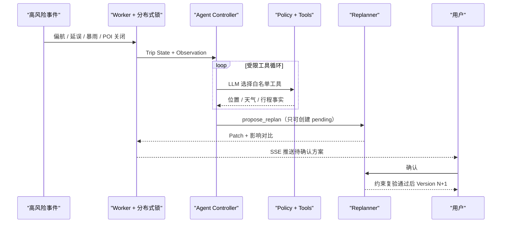

# MapGo AI-Planned 架构

## 决策边界

MapGo 采用模块化单体。规划、身份和个人数据共享事务边界；耗时事件由独立 Worker 消费 Redis 队列，但与 API 共享同一代码库与数据模型。

## Supervisor 拓扑与隔离 Agent

MapGo v7.1 引入 Supervisor Agent：Supervisor 负责任务拆分、Agent/阶段调度、状态管理和错误恢复。规划链路为 Supervisor -> Intent -> Supervisor Plan -> Search -> Planner -> Critic -> Final Answer；老人、无障碍、少步行等安全敏感请求会插入 Search -> Safety Check -> Planner；行中事件仍由 Companion Agent 处理。Search/Planner/Safety 是受控确定性阶段，不给 LLM 开放地图或求解工具权限。

当前规划链路：

```text
Planning Request
  -> Supervisor Agent（无工具，调度/状态/恢复）
  -> Intent Agent（无工具，只输出意图和澄清）
  -> Search Stage（Provider 事实召回，非 LLM 工具）
  -> Planner Stage（确定性联合求解，非 LLM 工具）
  -> Critic Agent（无工具，只读方案证据）
  -> Supervisor Final Answer / Validator / Plan Version

Trip Event
  -> Companion Agent（独立工具白名单）
  -> Policy / Consent / Confirmation
  -> pending Plan Patch
```

历史 v7 三 Agent 说明保留如下作为演进背景：

```text
Planning Request
  → Intent Agent（无工具）
  → intent_artifact
  → Provider 事实 + 线程隔离的联合求解器
  → plan_candidate
  → Critic Agent（无工具，只读证据）
  → review_report
  → 确定性 Validator / Plan Version

Trip Event
  → Companion Agent（独立工具白名单）
  → Policy / Consent / Confirmation
  → pending Plan Patch
```

Agent 不持有彼此实例，也不能直接 handoff。`AgentWorkflowRun` 记录工作流；`AgentRun` 记录角色、Prompt、预算、Token、成本和回退；`AgentArtifact` 保存版本化 payload、输入哈希、置信度和证据引用。Critic 支持 `off | shadow | enforce`，enforce 也最多触发一次软权重重算。

### Agent 通信协议 v1

Agent 之间不传递自由文本。所有交接经过 `AgentMessageRouter`，运行时信封包含：`protocol_version`、`message_id`、`task_id`、`sender`、`receiver`、`message_type`、`artifact_type`、结构化 `content`、`content_hash`、`idempotency_key`、`correlation_id`、`causation_id`、重试次数和时间字段。

Router 使用显式路由白名单并失败关闭。例如 Critic 只能把 `review_report` 发回 Supervisor，不能直接向 Search/Planner 下发硬约束；Companion 只能与 Tool Runtime 交换受控工具请求/结果，不能调用规划期 Agent。Search、Planner 和 Critic 会从消息信封重新验证并消费真实输入，而不是仅把消息当日志标签。

```text
User --planning_request--> Supervisor --planning_request--> Intent
Intent --intent_artifact--> Search --search_artifact--> Planner
Planner --plan_candidate--> Critic --review_report--> Supervisor
Supervisor --final_answer--> Final Answer

System --trip_observation--> Companion
Companion --tool_request--> Tool Runtime --tool_result--> Companion
Companion --companion_action_report--> Final Answer
```

每条消息使用内容哈希和因果 ID 追踪，幂等键避免同一因果输入被重复投递。运行时正文可包含完成任务所需的结构化数据；进入 API trace 和 `agent_messages` 表前会移除原始用户文本、密钥和精确坐标，超过审计上限的正文仅保存大小与顶层字段摘要。

### Shared State v1

消息负责“通知谁做什么”，Shared State 负责“当前任务已经确认了什么”。运行时状态保存在 Redis；本地与测试使用同一接口的内存实现。状态具有 `task_id`、`revision`、`phase`、TTL 和以下业务字段：

```text
AgentSharedState
  user_requirement       # Intent 的结构化需求、约束和当前偏好
  clarification_questions
  poi_candidates         # Search 的 Provider 候选
  route_plan             # Planner 的完整候选方案
  evaluation_result      # Critic Review Report
  soft_adjustments       # Supervisor 批准的有界软重算参数
  execution_context      # Companion 当前行中上下文
  execution_history      # 只追加的状态变更历史（字段名 + 哈希）
```

每次更新必须带调用方看到的 `expected_revision`。内存实现用进程锁原子比较，Redis 实现用 Lua CAS；revision 不匹配时拒绝更新，避免两个 Agent 静默覆盖状态。状态正文还带排除自身后的 SHA-256 `state_hash`，读取时重新计算以检测绕过 revision 的存储篡改。AgentMessage 只携带小型结果摘要、`shared_state_ref`、`state_revision` 和 `state_hash`，不再复制完整候选/路线；引用错误、陈旧或哈希不一致时接收方拒绝执行。

| 角色 | 可读状态 | 可写状态 |
|---|---|---|
| Supervisor | 全局状态与历史 | 软调整、工作流/错误上下文 |
| Intent | 当前需求与澄清 | `user_requirement`、澄清问题 |
| Search | 需求、偏好、软调整 | `poi_candidates` |
| Planner | 需求、候选、软调整 | `route_plan` |
| Critic | 需求与路线方案 | `evaluation_result` |
| Companion | 正式路线、评价、行中历史 | `execution_context` |

完整运行时状态默认 TTL 为 2 小时，允许包含求解所需的临时精确坐标，但不直接写入 PostgreSQL。PostgreSQL 的职责边界为：

- `UserPreference`：仅用户明确确认的长期偏好，不能从一次行为自动推断；
- `PlanningRun` / `PlanVersion` / `TripEvent`：正式任务、版本和旅行历史；
- `AgentSharedStateSnapshot`：工作流结束后的最小化摘要、revision、phase 与不可逆状态哈希，不保存完整候选或精确位置。

Companion 使用稳定的 `trip-{id}-state` 跨事件复用状态。用户接受 Patch 形成 PlanVersion N+1 后，下一次事件只能从数据库中的成功正式版本单向刷新路线；版本倒退或非成功方案会被拒绝。隐私清除接口会立即删除可定位到该用户的运行时 Shared State，而不是只等待 TTL。

Critic 从 `shadow` 切到 `enforce` 前必须先通过管理员 readiness 报告：最近 shadow 样本数达到 `CRITIC_ENFORCE_MIN_SHADOW_SAMPLES`，fallback、blocking、预算超限和 p95 延迟均低于阈值。报告只给出 `ready_for_enforce` 或 `keep_shadow` 建议，不自动改运行模式。

Agent 审计 payload 采用最小化持久化：`AgentArtifact`、`AgentRun.output_summary_json`、`AgentMessage.structured_json` 和 `AgentToolCall` 摘要会移除密钥、原始用户文本和精确坐标。原始输入只保留不可逆 `input_hash` 与 evidence refs，正式计划版本仍由 PlanVersion 按既有权限模型保存。

### Agent Tool Registry 与能力隔离

Tool Registry 是 Agent 能力授权的唯一清单，并将三种调用模式严格分开：

| 角色 | 模型可选择 Tool | 服务器内部 Capability | 禁止的数据/能力 |
|---|---|---|---|
| Supervisor | 无 | 无 | 地图、求解、用户数据、正式计划写入 |
| Intent | 无 | `parse_requirement` | POI、路线矩阵、求解器 |
| Search | 无 | `search_poi` | 求解器、用户长期数据 |
| Planner | 无 | `get_route_matrix`、`optimize_route`、`verify_transit_edges` | 用户长期偏好库、精确定位 Tool、写计划 |
| Critic | 无 | 无 | 地图、求解器、硬约束修改、写计划 |
| Companion | `get_trip_state`、`get_current_location`、`get_weather`、`propose_replan` | 无 | 规划期搜索/求解、正式 Patch/Version 写入 |

每项能力还声明精确数据域和副作用分类。执行入口必须同时匹配角色、调用模式和完整数据域；未知名称、跨角色、把内部 Capability 伪装成 LLM Tool、少报或多报数据域都会拒绝。`create_plan_patch`、`share_trip_status` 和 `save_explicit_preference` 等高影响操作没有 Agent owner，只能走带验证/确认的服务器专用流程。

Registry 解决“Agent 能否触达某能力”；Companion 的 Policy Engine 继续解决“当前 Trip State、Consent、确认和预算是否允许”。两层全部通过才会执行。授权结果通过 `mapgo_agent_capability_authorizations_total` 观测，未知输入统一聚合为固定标签，日志不记录参数和用户数据。

### Memory：短期任务上下文与长期偏好

短期 Memory 就是当前任务的 Shared State，保存本次需求、候选、路线、评价与执行历史。规划正常完成、需要澄清或异常退出时，Supervisor 会在最小审计摘要进入 Trace 后主动删除 RuntimeStore key；TTL 只处理进程崩溃等未执行清理的情况。Companion 使用的行中状态持续到 Trip 完成，完成后同样主动删除。

长期 Memory 使用 PostgreSQL `UserPreference`，但不是自动画像。只有显式确认且通过白名单 Schema 的软偏好可以持久化，包括少走路、距离/费用/评分目标、饮食限制、优化目标，以及有界的地点类别/环境召回提示。行程行为、定位、Critic 建议和隐式推断不会自动写入。

```text
当前请求中的结构化偏好
  > 当前文本中明确表达的相关意图
  > PostgreSQL 已确认长期偏好
  > Parser 默认值
```

长期偏好由 API/Supervisor 边界读取并转换成规范化默认值；Intent 只能看到本次有效请求，Planner 只能看到类型化 `PlanningPreferences`，所有 Agent 都没有查询用户偏好表的工具。响应只列出应用/跳过的 key，不复制偏好值。用户可以用 `use_long_term_memory=false` 单次停用，并可查询、逐项删除、隐私导出或全部清除。多轮会话在首轮冻结有效偏好，避免会话过程中发生无提示漂移。

### Agent Evaluation 与质量门禁

评测分为意图与路线两层。意图集覆盖任务、交通方式、截止时间和偏好字段，特别包含“`不想爬山，希望轻松旅游` → `avoid_hiking=true, travel_style=relaxed`”的正负例。路线集使用完整计划快照，检查时间限制、重复 POI、距离目标和可观察的偏好行为。

```text
最终分 = 距离合理性 × 40% + 时间合理性 × 30% + 用户偏好匹配 × 30%
```

默认通过线为 75 分。但硬失败不能被加权平均抵消：非成功/空路线、缺少或重复 Provider POI ID、任务 deadline、最晚返回、总时长、步行、费用硬限制，以及达到评测合理距离两倍的路线都会直接得到 0 分。明确偏好采用全满足规则，漏掉一个明确偏好时偏好分为 0，不能靠距离和时间高分掩盖。

离线 `evaluate_routes.py` 与运行时 Critic 共用 `agent_evaluation.py`。Critic 的 `ReviewReport.route_evaluation` 包含三个分项、总分、公式、通过状态和硬失败 code；即使启用 LLM Critic，服务器确定性硬失败仍会覆盖模型结论。线上输出 `mapgo_agent_route_evaluation_score` 和固定 code 的硬失败计数，CI 对意图字段准确率、路线期望准确率、硬失败检出率和优质路线最低分设置门禁。

评测边界：case 中的距离/时间目标是版本化基准，不是所有城市通用真理；真实 LLM 漂移、Provider 地域差异和用户满意度仍需线上抽样集补充。

```text
Web Client
   │
FastAPI Modular Monolith
   ├─ Identity / Personal Data
   ├─ Intent Parser (LLM + RuleBased runtime fallback)
   ├─ Map / Weather / Knowledge Providers
   ├─ Joint Planner (Exact / OR-Tools / Beam fallback)
   ├─ Initial-plan Validator / Patch Recalculator
   ├─ Plan Version / Patch Policy
   ├─ Companion Trip Session + Agent Controller
   └─ Runtime Store (Redis or in-memory)
   │
Worker  ←── Redis queues / locks / pubsub
   │
PostgreSQL (Compose / CI) or SQLite (local / E2E)
```



## 一次规划

1. API 校验身份、请求体、配额边界与幂等指纹。
2. Parser 只提取用户表达，不生成 POI；LLM 故障时降级到规则解析器。
3. 缺少可验证硬约束时返回动态澄清问题。
4. Map Provider 并发召回每个任务的候选 POI。
5. 全部候选合并成受 `MAX_ROUTE_MATRIX_POINTS` 限制的矩阵。
6. 求解器同时选择每个任务的一个候选并决定访问顺序。
7. 初次规划 Validator 检查时间窗、任务顺序、评分、营业状态、无障碍、步行、总时长、费用、区域与不确定缓冲。
8. 成功或不可行结果都保留事实来源、置信度和冲突。
9. 非澄清结果写入 `plan_versions` 的 Version 1。

## 联合求解

站点和候选数较小时，求解器枚举候选组合与访问排列，得到可用于回归测试的精确基准。搜索空间超过阈值后优先尝试 OR-Tools 时间窗路由，再回退联合 Beam Search。

目标函数包含：

```text
travel_time
+ walking_time
+ distance
+ low_rating_penalty
+ uncertainty_penalty
+ monetary_cost
+ change_penalty
```

权重位于请求的 `preferences.weights`，硬约束不通过时不会用软目标“抵消”。精确枚举会用完整权重比较全部候选；当前 OR-Tools/Beam 的搜索阶段使用固定的近似代价，随后再用完整评价器验证其结果，因此大规模搜索尚不能保证找到请求权重下的全局最优可行方案。

## Plan Patch

计划调整遵循 optimistic concurrency：

```text
Version N
  → Patch(base_version=N, pending)
  → 用户确认
  → 路线矩阵重算
  → 硬约束复验
  ├─ blocked: Version N 保持不变
  └─ allowed: 生成 Version N+1
```

所有路径写入 `decision_audit_logs`，包括阻止执行的规则。

Patch 操作包括 `remove_stop`、`move_stop`、`replace_stop`、`change_transport_mode`。接受时会在新地点与新交通方式下重新计算路线，并复验站点 deadline、最晚返回、步行上限和总费用；这些检查产生冲突时会阻止新 Version 写入。评分、营业、无障碍、区域、任务顺序和最大总时长等首次规划约束尚未统一复用到 Patch 接受路径，这是当前明确的技术债。

## 伴游与 Worker

- Trip Session 管理状态机、Consent 与定位 TTL；
- 位置更新可自动做路线走廊偏航检测并生成 `UserOffRoute`；
- Agent Controller 按 Observation → LLM Decision → Policy → Tool → Observation 循环编排。模型只能输出白名单工具或结束，不能写入 PlanVersion；无 LLM 或 LLM 调用失败时降级为同一边界内的规则决策器；
- Worker 通过 Redis List 消费 `mapgo:trip-events` / `mapgo:notifications`，失败时进入 ZSET 延迟重试，耗尽后进入死信队列；
- 高影响事件可自动产生待确认 Patch。Worker 锁和事件状态避免重复消费生成多个 Patch；Patch 应用仍需要用户确认。

Worker 使用“主队列 → processing list → ack”的保留/确认流程。进程处理期间硬崩溃后，下一次 Worker 启动会把 processing 中的在途消息恢复到主队列；数据库事件幂等状态负责吸收成功后未 ack 带来的重复投递。行程锁仍使用 `SET NX EX` 与 token 校验释放，但没有租约续期；更高吞吐生产环境仍可升级 Redis Streams Consumer Group、消息代理或数据库 outbox/inbox 与 fencing token。

## SSE 与事件可见性

API 和 Worker 会把最新行程事件写入 `trip-stream:{trip_id}`，SSE 端点轮询这一快照并发送给已认证客户端。`Last-Event-ID` 只避免重连后重复发送同一快照；如果多个事件在两次轮询之间到达，中间事件可能被最新快照覆盖，因此当前 SSE 不是持久化事件日志。

## 运行时并发边界

地图和数据库调用使用异步 I/O；联合求解器通过 `asyncio.to_thread` 与 API 事件循环隔离。搜索空间和 OR-Tools 时间限制仍受配置约束；更高并发和严格 CPU 配额场景可进一步迁移到进程池或独立规划 Worker。

## 请求入口与内存边界

- 请求体同时检查 `Content-Length` 和实际 ASGI 字节流，默认上限由 `MAX_REQUEST_BYTES` 控制；
- 登录/注册使用来源 IP 作为限流身份，不能通过轮换 `X-Device-Id` / `X-Device-Name` 获得新预算；已登录 API 使用 Session Token 摘要作为细粒度身份，同时保留宽松的 IP 总额度；
- 外部 Request/Trace ID 只接受安全字符和有限长度；404 等未匹配路由统一聚合为 `__unmatched__` 指标标签，避免指标基数无界增长；
- `/api/` 响应默认 `Cache-Control: no-store`，并附带内容嗅探、Frame、Referrer 和 Permissions Policy；
- `InMemoryRuntimeStore` 限制 JSON 缓存条目、缓存总字节数和计数器数量；缓存超限时淘汰旧值，计数器 key 洪泛时失败关闭。生产多实例仍应使用 Redis；
- 高德代理有路径白名单、独立 IP 限流、上游响应体上限和更小的可缓存响应上限；只有成功且合法的 JSON 会写入缓存。

## 数据可信度

每条路线边的 `source/quality/traffic_timestamp/confidence/fallback_used` 是正式 API 合同。任何回退都降低置信度并在前端显示“估算”，不能以精确概率 ETA 的口吻呈现。

当前规划时使用的是 Provider 置信度与安全缓冲构成的启发式区间。`calibrate_from_history()` 仍是离线辅助函数，尚未获得按交通方式、时段聚合的真实 ETA 样本，所以不作为在线“历史残差校准”能力宣称。
