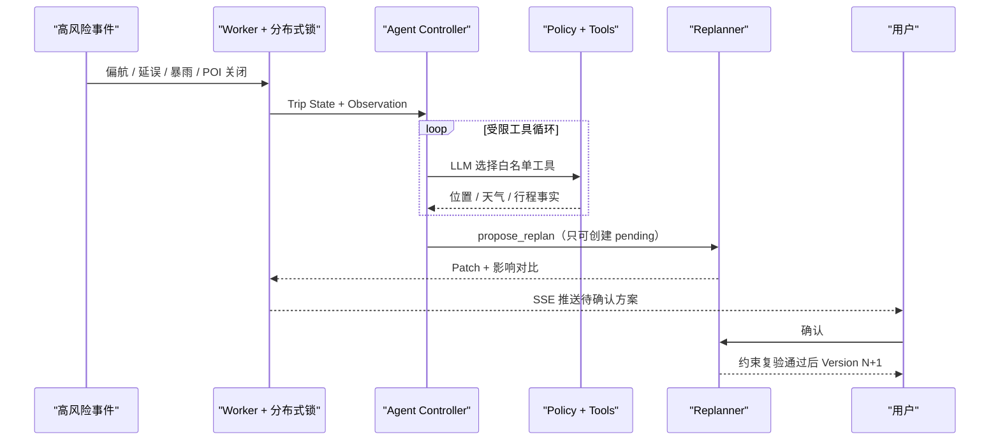

# MapGo AI-Planned 架构

## 决策边界

MapGo 采用模块化单体。规划、身份和个人数据共享事务边界；耗时事件由独立 Worker 消费 Redis 队列，但与 API 共享同一代码库与数据模型。

```text
Web Client
   │
FastAPI Modular Monolith
   ├─ Identity / Personal Data
   ├─ Intent Parser (LLM + RuleBased runtime fallback)
   ├─ Map / Weather / Knowledge Providers
   ├─ Joint Planner (Exact / Beam / OR-Tools)
   ├─ Constraint Validator
   ├─ Plan Version / Patch Policy
   ├─ Companion Trip Session + Agent Controller
   └─ Runtime Store (Redis or in-memory)
   │
Worker  ←── Redis queues / locks / pubsub
   │
PostgreSQL
```



## 一次规划

1. API 校验身份、请求体、配额边界与幂等指纹。
2. Parser 只提取用户表达，不生成 POI；LLM 故障时降级到规则解析器。
3. 缺少可验证硬约束时返回动态澄清问题。
4. Map Provider 并发召回每个任务的候选 POI。
5. 全部候选合并成受 `MAX_ROUTE_MATRIX_POINTS` 限制的矩阵。
6. 求解器同时选择每个任务的一个候选并决定访问顺序。
7. Validator 检查时间窗、任务顺序、评分、步行、总时长、区域与不确定缓冲。
8. 成功或不可行结果都保留事实来源、置信度和冲突。
9. 非澄清结果写入 `plan_versions` 的 Version 1。

## 联合求解

站点和候选数较小时，求解器枚举候选组合与访问排列，得到可用于回归测试的精确基准。搜索空间超过阈值后优先尝试 OR-Tools 时间窗路由，再回退联合 Beam Search。

目标函数包含：

```text
travel_time
+ walking_time
+ distance
+ low_rating_penalty
+ uncertainty_penalty
+ monetary_cost
+ change_penalty
```

权重位于请求的 `preferences.weights`，硬约束不通过时不会用软目标“抵消”。

## Plan Patch

计划调整遵循 optimistic concurrency：

```text
Version N
  → Patch(base_version=N, pending)
  → 用户确认
  → 路线矩阵重算
  → 硬约束复验
  ├─ blocked: Version N 保持不变
  └─ allowed: 生成 Version N+1
```

所有路径写入 `decision_audit_logs`，包括阻止执行的规则。

Patch 操作包括 `remove_stop`、`move_stop`、`replace_stop`、`change_transport_mode`。接受时会在新地点与新交通方式下重新计算路线、时间窗、步行上限和费用上限；任何冲突都会阻止新 Version 写入。

## 伴游与 Worker

- Trip Session 管理状态机、Consent 与定位 TTL；
- 位置更新可自动做路线走廊偏航检测并生成 `UserOffRoute`；
- Agent Controller 按 Observation → LLM Decision → Policy → Tool → Observation 循环编排。模型只能输出白名单工具或结束，不能写入 PlanVersion；无 LLM 或 LLM 调用失败时降级为同一边界内的规则决策器；
- Worker 消费 `mapgo:trip-events` / `mapgo:notifications`，支持重试与死信；
- 高影响事件可自动产生待确认 Patch。Worker 锁和事件状态避免重复消费生成多个 Patch；Patch 应用仍需要用户确认。

## 数据可信度

每条路线边的 `source/quality/traffic_timestamp/confidence/fallback_used` 是正式 API 合同。任何回退都降低置信度并在前端显示“估算”，不能以精确概率 ETA 的口吻呈现。

当前规划时使用的是 Provider 置信度与安全缓冲构成的启发式区间。`calibrate_from_history()` 仍是离线辅助函数，尚未获得按交通方式、时段聚合的真实 ETA 样本，所以不作为在线“历史残差校准”能力宣称。
