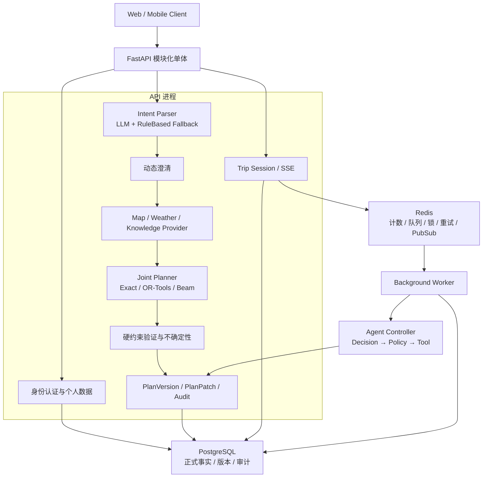
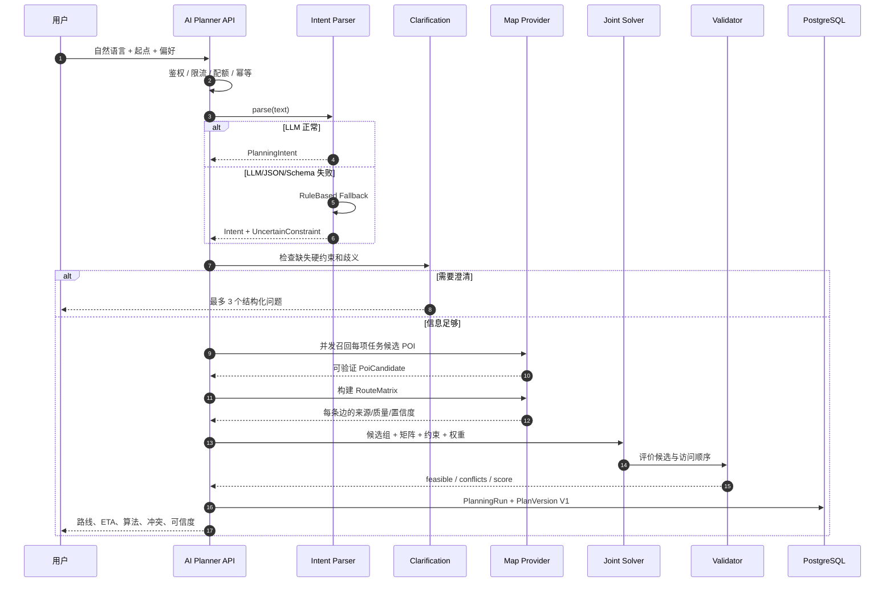
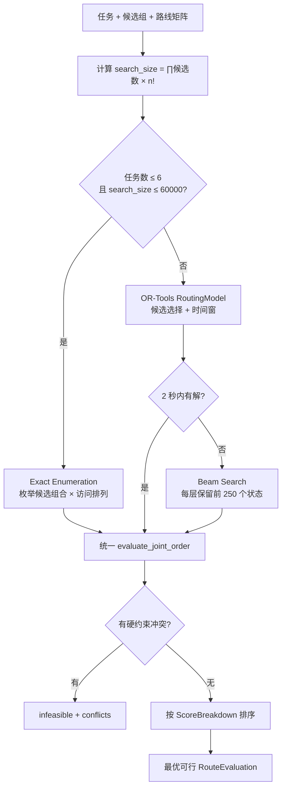
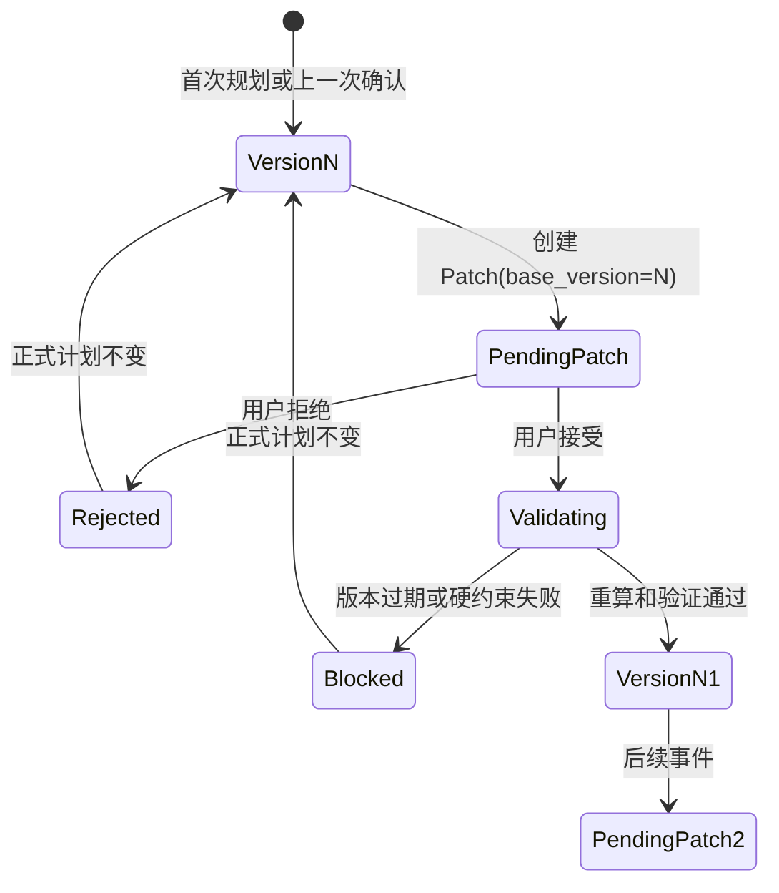
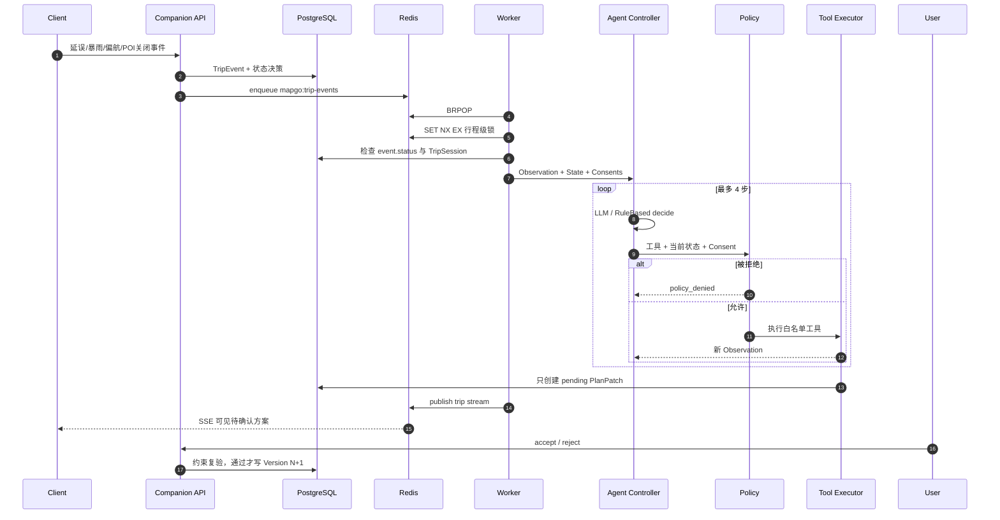
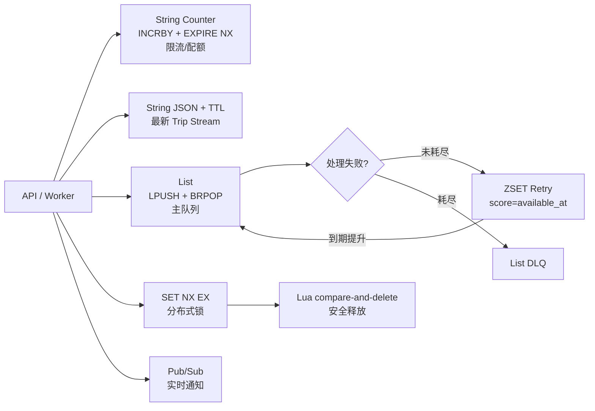
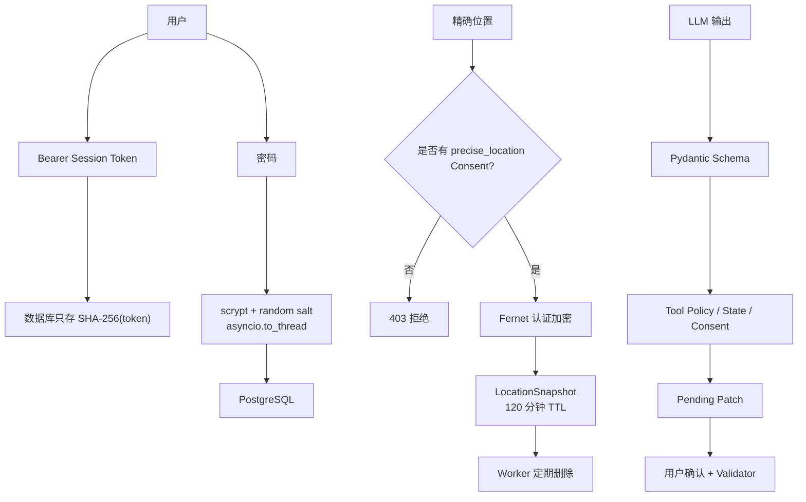
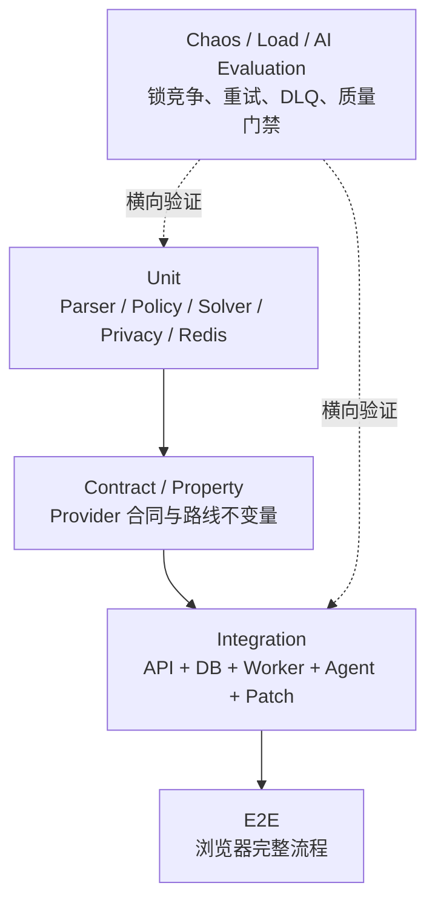

# MapGo 面试项目拷打速成手册（零基础代码版）

> 适用岗位：Python 后端、AI 应用工程师、全栈工程师。  
> 建议学习周期：10 天，每天 3～4 小时；文末有 3 天极限压缩版。  
> 使用原则：先沿代码走通真实链路，再背回答；所有能力和边界以当前仓库代码为准。

---

## 0. 先看结论：这个项目究竟应该怎么讲

MapGo 当前最有面试价值的不是“地图页面功能很多”，而是下面四条后端主线：

| 优先级 | 项目主线 | 建议准备占比 | 核心代码 |
|---|---|---:|---|
| S | LLM 意图解析与确定性规划边界 | 25% | `intent_parser.py`、`planning_service.py` |
| S | 候选 POI 与访问顺序联合求解 | 25% | `route_optimizer.py` |
| S | Agent + Worker 驱动动态重规划 | 20% | `agent_controller.py`、`worker.py`、`replanning.py` |
| A | Redis 幂等、锁、重试、DLQ、SSE | 12% | `runtime_store.py`、`companion.py` |
| A | Plan Version / Patch 乐观并发与审计 | 8% | `ai_planner.py`、`models.py` |
| B | 安全、隐私、可观测性、测试、CI | 8% | `security.py`、`privacy.py`、`.github/workflows/ci.yml` |
| C | 前端地图交互和普通 CRUD | 2% | `public/js/modes/plan.js` |

### 0.1 当前仓库的真实证据

本手册整理时，Python 测试结果为：

```text
36 passed
总覆盖率 63.16%
规划服务约 81%
动态重规划约 79%
Agent Controller 约 84%
地图 Provider 约 86%
```

你面试时只能说自己实际运行、能解释的数据，不要编造 QPS、用户数或线上 SLA。

### 0.2 两份面试材料怎么用

`docs/INTERVIEW.md` 已经同步到当前 FastAPI 版本，适合面试前快速复习；本手册适合逐段走代码和准备追问。两份材料都不要替代现场运行结果，测试数量、覆盖率和能力边界以当前代码与 CI 为准。

---

## 1. 项目介绍标准答案

### 问题 1：请介绍一下你的项目

#### 30 秒回答

> MapGo 是一个 AI 行程规划与伴游系统。LLM 只负责把自然语言解析成结构化意图，真实 POI 必须来自地图 Provider，候选地点选择、访问顺序和时间窗由确定性求解器完成。行程中发生偏航、暴雨、延误或地点关闭时，Worker 会驱动一个受工具白名单、状态机、授权和预算约束的 Agent 生成待确认 Plan Patch；用户确认并重新验证硬约束后，才会产生新的正式计划版本。

#### 2 分钟回答

> 这个项目解决的是自然语言出行需求无法直接安全转化为可执行路线的问题。用户可能只说“明天下午带父母去两个景点，中午找一家评分高的餐厅，五点前回家，尽量少走路”，里面既有自然语言理解，也有地图事实、时间窗、无障碍、步行上限和成本等约束。
>
> 我的处理方式是把非确定性和确定性边界拆开。LLM 只能输出经过 Pydantic 严格校验的 PlanningIntent，不允许自己生成 POI。系统根据意图并发调用地图 Provider 召回每项任务的候选地点，再构建路线矩阵。小规模问题枚举候选组合和访问顺序，规模变大后优先使用 OR-Tools，失败时回退 Beam Search。每个方案都会统一验证截止时间、预约、步行、费用、区域、评分、营业和无障碍等约束，硬约束失败不能被软评分抵消。
>
> 正式计划使用不可变 PlanVersion 保存。行程中如果出现偏航、暴雨、延误或 POI 关闭，事件先进入数据库和 Redis 队列，Worker 获取行程级分布式锁，再驱动一个有最大步数、Token、费用、状态和 Consent 限制的 Agent。Agent 只能生成 pending Patch，用户确认并重新计算路线后才能产生 Version N+1。这样模型升级或异常都不能直接覆盖正式计划，同时整个过程可以审计和回放。

#### 5 分钟回答顺序

如果面试官说“展开讲讲”，按下面顺序，不要想到哪说到哪：

1. 业务问题：自然语言模糊、地图事实易变、硬约束必须可靠。
2. 架构边界：LLM 解析，Provider 提供事实，求解器负责决策。
3. 首次规划：澄清 → POI → 矩阵 → 联合求解 → V1。
4. 动态规划：事件 → Worker → Agent → pending Patch → 用户确认 → V2。
5. 工程保障：Redis、幂等、分布式锁、重试、DLQ、审计、指标和测试。
6. 主动说边界：不是 Exactly Once，SSE 不是完整事件日志，Patch Validator 仍可统一加强。

### 问题 2：项目中有多少是你自己做的？

#### 回答模板

> 我会如实说明自己的实际参与范围。但对现在用于面试的版本，我已经沿着请求入口、规划服务、求解器、数据库版本、Worker 和 Agent 重规划链路逐段走读，并能运行测试、修改约束、补测试和解释失败边界。即使某段最早不是我从空文件开始写的，我也不会把没理解的内容当成自己的亮点。

---

## 2. 零基础先修：先弄懂这些名词

### 2.1 API、Service、Provider、Model 分别是什么

| 名词 | 在项目中的职责 | 类比 |
|---|---|---|
| API Router | 接收 HTTP 请求、鉴权、校验、返回响应 | 前台接待 |
| Service | 编排业务流程 | 项目经理 |
| Provider / Client | 调用高德、天气等外部系统 | 外部供应商接口 |
| Schema | 规定输入输出的数据形状 | 表格模板 |
| ORM Model | 把 Python 对象映射到数据库表 | 数据档案柜 |
| Runtime Store | 保存短期计数、队列、锁、推送状态 | 临时调度中心 |
| Worker | 后台消费耗时事件 | 后台处理员 |

### 问题：为什么不把所有逻辑写在 API 函数中？

#### 答案

> API 层应该只处理协议问题，例如鉴权、请求参数和 HTTP 错误；规划逻辑放在 Service 后，可以被 API、Worker、测试和未来的定时任务复用。Provider 抽象又让真实高德和 Mock Provider 可以替换，这样单元测试不需要访问真实网络。

### 2.2 同步、异步和并发是什么

- 同步：当前任务完成后才做下一个。
- 异步：等待网络或数据库时把执行权交还事件循环。
- 并发：多个任务在时间上交错推进。
- 并行：多个 CPU 核心真的同时执行。

项目中的 `asyncio.gather` 并发召回 POI 是异步并发；同步的路线求解并不会因为外层是 `async def` 自动变成并行。

### 问题：FastAPI 使用 async 后是不是所有代码都不会阻塞？

#### 答案

> 不是。异步只在代码主动 `await` I/O 时释放事件循环。当前 `optimize_joint_route()` 是同步 CPU 计算，并且直接在异步规划请求中执行；搜索空间接近阈值或 OR-Tools 运行两秒时仍可能阻塞事件循环。生产化可以把求解放到 `asyncio.to_thread`、进程池或独立任务队列。

### 2.3 硬约束与软目标

硬约束是违反后方案不能用，例如五点前到医院；软目标是越小或越大越好，例如尽量少走路。

```text
硬约束：决定 feasible = True / False
软目标：在 feasible 方案之间计算 cost 并排序
```

### 问题：能否用更高评分抵消迟到十分钟？

#### 答案

> 不能。迟到属于硬约束冲突，高评分属于软目标。代码先把截止时间冲突加入 `conflicts`，最终用 `feasible=not conflicts` 判断可行性；评分只参与 `ScoreBreakdown`，不能把不可行方案变成可行方案。

---

## 3. 图一：系统总架构图

### 3.1 面试时要画什么

白板上画五层：客户端、API 模块化单体、确定性规划内核、后台 Worker、数据基础设施。不要一上来画几十个类。



### 3.2 手绘步骤

面试时按下面顺序画，控制在 60～90 秒：

1. 左上写 `Client`，中间画一个大框写 `FastAPI Modular Monolith`。
2. 大框内部从左到右写 `Parser → Provider → Solver → Validator → Version`。
3. 在大框下方画 `PostgreSQL`，从 Version 连过去，说明保存正式事实。
4. 右侧画 `Redis → Worker → Agent`，Agent 再指向 `pending Patch`。
5. 最后在 Parser 和 Version 之间画一道竖线，强调“LLM 不直接改正式计划”。

### 3.3 画图时配套讲稿

> 整体是模块化单体，身份、规划和个人数据共享数据库事务边界；耗时事件由独立 Worker 消费，但 API 和 Worker 共享同一代码库与数据模型。首次规划沿 Parser、Provider、Solver、Validator 进入 Version；动态事件沿 Redis、Worker、Agent 生成 pending Patch。PostgreSQL 是正式事实源，Redis 只保存短期运行态和调度数据。

### 3.4 代码证据

- FastAPI 初始化和依赖生命周期：`backend/app/main.py` 的 `lifespan()`。
- 路由注册：`backend/app/main.py` 的 `include_router` 循环。
- Provider 构造：`lifespan()` 中的 `build_map_provider()`。
- Worker 入口：`backend/app/worker.py` 的 `run_worker()`。
- 数据模型：`backend/app/models.py`。

### 问题：为什么选择模块化单体而不是微服务？

#### 答案

> 当前规划、身份、版本和隐私数据关系紧密，共享事务边界可以降低分布式事务和跨服务调用复杂度。Worker 独立进程已经隔离了耗时任务。等到地图调用、规划求解或通知出现独立扩缩容需求，再按稳定边界拆服务，比一开始为了形式拆微服务更合理。

### 继续追问：以后优先拆哪个模块？

#### 答案

> 优先考虑路线求解 Worker，因为它是 CPU 密集、资源模型与 API I/O 不同；其次是通知模块，因为它有独立重试和多渠道适配需求。身份和 PlanVersion 仍应尽量保持强一致边界。

---

## 4. 图二：首次规划完整时序图



### 4.1 手绘步骤

1. 横向写六个参与者：用户、API、Parser、Provider、Solver、DB。
2. 先画主干：用户 → API → Parser → Provider → Solver → DB。
3. 在 Parser 后画一个分叉：信息不足返回澄清；足够才访问 Provider。
4. 在 Provider 返回箭头旁写 `source/quality/confidence`。
5. 在 Solver 和 DB 中间写 `hard constraints`。
6. DB 中明确写 `Run + Version 1`，不是只写“保存结果”。

### 问题：为什么澄清发生在查询 POI 之前和之后两处？

#### 答案

> 查询前的澄清处理缺少起点、步行上限等输入缺口；查询后的澄清处理同名 POI、多候选歧义和 Provider 找不到地点。两者依赖的信息不同，所以不能只做一次统一的前置澄清。

---

## 5. 首次规划代码手把手走读

下面使用示例请求贯穿全链路：

```json
{
  "text": "明天下午两点从酒店出发，先去公园，再去医院，晚上五点前到医院，尽量少走路",
  "origin": {"lng": 120.62, "lat": 31.32},
  "transport_mode": "walking",
  "default_service_duration_minutes": 15,
  "city": "苏州"
}
```

### 5.1 第一步：API 预算与幂等

入口有两个：Web 主流程使用 `start_planning_conversation()`（`POST /api/ai/conversations`），兼容的一次性流程使用 `create_ai_plan()`（`POST /api/ai/plans`）。两者都支持 `Idempotency-Key`、请求指纹、处理中状态和成功响应重放；会话接口使用独立 owner namespace，避免与一次性接口的 Key 冲突。

执行顺序：

1. 构建 Parser。
2. 把用户 ID、规范化请求、模型名、Prompt 版本计算成 SHA-256 指纹。
3. 如果存在 `Idempotency-Key`，查询 `IdempotencyRecord`。
4. 相同 Key + 不同指纹返回 409。
5. 相同 Key + 已成功直接重放保存的响应。
6. 新请求先写 `processing`，再真正调用规划服务。

#### 问题：为什么幂等 Key 还要配请求指纹？

##### 答案

> 只有 Key 没有指纹时，客户端误把同一个 Key 用在两个不同请求上，系统可能返回第一次请求的结果。指纹把用户、请求正文、模型和 Prompt 版本绑定起来；同 Key 不同指纹直接拒绝，避免错误重放。

#### 问题：幂等和去重有什么区别？

##### 答案

> 幂等关注重复执行产生相同外部效果，并且通常能返回第一次结果；去重只关注“不再处理第二次”。本项目 AI 规划接口保存完整响应用于重放，是幂等；TripEvent 的唯一 event_id 更接近事件去重。

### 5.2 第二步：LLM 只抽取意图

代码：`backend/app/services/intent_parser.py` 的 `OpenAICompatibleIntentParser`。

关键点：

- 使用 `PlanningIntent.model_json_schema()` 生成 Schema。
- 递归设置 `additionalProperties=false` 和 required 字段。
- System Prompt 明确“不猜测具体 POI”。
- 返回内容仍要经过 `json.loads` 和 `PlanningIntent.model_validate`。
- HTTP、JSON、Schema 任一失败都包装为上游错误。

理想化输出可能是：

```json
{
  "origin": "酒店",
  "departure_time": "2026-08-02T14:00:00+08:00",
  "transport_mode": "walking",
  "tasks": [
    {"description": "去公园", "location_name": "公园", "service_duration_minutes": 0},
    {
      "description": "五点前到医院",
      "location_name": "医院",
      "service_duration_minutes": 0,
      "deadline": "2026-08-02T17:00:00+08:00"
    }
  ],
  "preferences": {"minimize_walking": true},
  "constraints": {"hard": {}, "uncertain": []}
}
```

#### 问题：有了 JSON Schema，LLM 就不会幻觉了吗？

##### 答案

> 不会。Schema 只保证字段和类型合法，无法证明医院真的存在或营业。事实仍必须由地图 Provider 返回，营业、距离和路线等信息也必须附带来源和质量标记。

### 5.3 第三步：LLM 故障降级

代码：`backend/app/services/intent_parser.py` 的 `FallbackIntentParser` 与 `RuleBasedIntentParser`。

`FallbackIntentParser` 捕获主 Parser 的任意故障，改用规则解析器，并写入：

```text
field = intent_parser
confidence = 0.45
safety_buffer_minutes = 10
```

#### 问题：为什么不能静默降级？

##### 答案

> 静默降级会让前端和用户误以为模型正常理解了复杂约束。显式写入不确定约束后，求解器会使用安全缓冲，响应也会带警告，便于监控 LLM fallback 比例。

### 5.4 第四步：多轮澄清真的改变后续规划

代码：

- 问题选择：`backend/app/services/clarification.py` 的 `select_clarification_questions()`。
- 答案应用：同文件的 `apply_clarification_answer()`。
- 会话 revision 检查：`backend/app/api/ai_planner.py` 的 `continue_planning_conversation()`。
- 答案进入真实意图：同文件的 `_execute_conversation_plan()` 与 `PlanningService.plan()`。

澄清问题最多返回 3 个，必填问题排在可选偏好之前。`base_revision` 用于阻止用户基于旧会话状态提交答案。

#### 问题：为什么不能只把澄清答案保存在数据库里展示？

##### 答案

> 因为答案必须真正改变候选召回和求解输入。例如用户补充“清真”，它必须进入餐饮任务的查询关键字；用户选择某个同名 POI 后，候选组必须只保留那个 POI，否则求解器可能为了低成本又换成另一个同名地点。

### 5.5 第五步：并发召回候选 POI

代码：`backend/app/services/planning_service.py` 的 `PlanningService._search_candidates()` 与 `PlanningService.plan()`。

```python
search_results = await asyncio.gather(
    *(map_provider.search_poi(keyword, origin, city) for keyword in keywords)
)
```

每个任务最多请求 1～5 个候选，但还要受 `MAX_ROUTE_MATRIX_POINTS=25` 限制。起点占一个矩阵点，剩余预算公平分给任务，防止候选数导致上游调用呈平方级膨胀。

#### 问题：为什么矩阵调用容易爆炸？

##### 答案

> N 个点的完整路线矩阵有 N² 条边。即使 Provider 支持批量接口，请求体、响应体、配额和后续搜索空间也会快速增长，因此不能让每个任务无限召回候选。

### 5.6 第六步：构建正式 RouteMatrix

代码：`backend/app/clients/amap_client.py` 各 `MapProvider.route_matrix()` 实现。

每条 `RouteEdge` 都包含：

- `distance_meters`
- `duration_seconds`
- `source`
- `quality`
- `traffic_timestamp`
- `confidence`
- `fallback_used`

真实接口某条边缺少 duration 时，不直接丢弃整个矩阵，而是保留 Haversine 估算边并降低 confidence。

#### 问题：为什么不把估算值伪装成正常 ETA？

##### 答案

> 因为用户可能依据 ETA 安排预约。来源和不确定性是 API 合同的一部分，fallback 必须显式展示为估算，不能用精确概率或精确到分钟的口吻误导用户。

### 5.7 第七步：调用联合求解器

代码：`backend/app/services/planning_service.py` 的 `PlanningService.plan()`。

系统把每个 POI 转成 `CandidateNode`，其中保留任务下标、候选排名、矩阵下标、评分、费用、营业、无障碍和行政区信息，然后交给 `optimize_joint_route()`。

### 5.8 第八步：生成结果和 V1

代码：

- 结果生成：`backend/app/services/planning_service.py` 的 `PlanningService.plan()`。
- Run 和 V1：`backend/app/api/ai_planner.py` 的 `_execute_conversation_plan()` 与 `create_ai_plan()`。

`PlanningRun` 保存输入、Parser、Prompt、Provider、Token、费用和 Trace；只要不处于澄清状态，系统就保存 Version 1，包括成功或不可行快照。

这里必须区分“可审计”和“可执行”：不可行 Version 可以保留，但创建 `TripSession` 时会同时检查 `PlanningRun.status == "success"`、快照 `status == "success"` 和 `planning_state == "PLAN_READY"`。因此不可行结果不能开始行程。

#### 问题：为什么不可行结果也值得保存？

##### 答案

> 不可行本身是一次有价值的确定性结论。保存输入、候选、冲突和模型版本后，可以复盘到底是时间窗、地点还是数据质量导致失败，也能用于后续回归测试和模型评估。

---

## 6. 图三：联合求解器到底在做什么

### 6.1 先理解问题，不要一上来背 OR-Tools

传统 TSP 假设每个城市已经确定，只决定访问顺序。MapGo 还要为每项任务选择一个真实 POI，所以实际同时做两件事：

```text
任务 0：公园 A / 公园 B / 公园 C 选一个
任务 1：餐厅 A / 餐厅 B / 餐厅 C 选一个
任务 2：医院 A / 医院 B / 医院 C 选一个
然后再决定三个任务的访问顺序
```

如果有 3 个任务，每项 2 个候选：

```text
候选组合数 = 2 × 2 × 2 = 8
每种组合的访问排列 = 3! = 6
总搜索空间 = 8 × 6 = 48
```

如果有 6 个任务，每项 3 个候选：

```text
候选组合数 = 3^6 = 729
访问排列数 = 6! = 720
总搜索空间 = 524,880
```

因此不能只背“6! 是 720”，候选组合才是搜索空间迅速爆炸的另一半。

### 6.2 算法选择流程图



### 6.3 手绘步骤

1. 顶部写 `tasks + candidate groups + matrix`。
2. 画第一个菱形：`n ≤ 6 && ∏cᵢ × n! ≤ 60000`。
3. 左分支写 Exact；右分支写 OR-Tools。
4. OR-Tools 下再画“无解/没安装”分支到 Beam。
5. 三条分支汇合到同一个 `Validator`。
6. Validator 后先判断 `feasible`，再比较 `score`。

### 6.4 Exact 精确枚举

代码：`backend/app/services/route_optimizer.py` 的 `optimize_joint_route()` 精确枚举分支。

```python
for selection in product(*candidate_groups):
    selected = {node.task_index: node for node in selection}
    for permutation_order in permutations(range(count)):
        evaluations.append(_evaluate(list(permutation_order), selected))
```

它能保证在枚举空间内找出全局最优，因此适合作为小规模真实求解和大规模近似算法的回归基准。

#### 问题：Exact 为什么不用于所有请求？

##### 答案

> 时间复杂度大致为候选数乘积再乘 n!，任务和候选增加时呈组合爆炸。精确求解只适合小规模；大规模必须用约束求解或启发式搜索换取可接受延迟。

### 6.5 Beam Search

代码：`backend/app/services/route_optimizer.py` 的 `_beam_joint()`。

一个 Beam 状态保存：

```text
已访问任务顺序
每项已选择的候选
最后一个矩阵点
便宜的近似路径分数
```

每扩展一层，把所有可能的“下一个任务 + 候选”加入列表，按便宜分数排序，只保留前 250 个。

#### 问题：Beam Search 和 BFS、贪心有什么区别？

##### 答案

> BFS 保留一层的全部状态，内存可能爆炸；纯贪心每层只保留一个最优状态，容易过早走入局部最优；Beam Search 保留固定宽度的多个候选路径，是二者之间的折中，但不保证全局最优。

### 6.6 OR-Tools 建模

代码：`backend/app/services/route_optimizer.py` 的 `_ortools_joint()`。

关键概念：

1. `RoutingIndexManager` 管理求解器内部下标。
2. 节点 0 是起点，其余节点对应所有候选 POI。
3. Arc Cost 包括路线时间、服务时间、评分、费用和不确定惩罚。
4. Time Dimension 表示累计时间，允许等待。
5. 同一任务的候选节点加入 Disjunction。
6. `sum(ActiveVar) == 1` 强制每项任务恰好选择一个候选。
7. 预约时间和截止时间转成时间窗。
8. 搜索最多运行 2 秒。

#### 问题：为什么预约时间早到后可以等待，晚到却是冲突？

##### 答案

> 预约表示固定到达时刻。早到可以等待，因此把 cursor 推进到 appointment_time；晚到意味着错过预约，必须产生硬约束冲突。对应代码在 `evaluate_joint_order()` 的预约时间分支。

### 6.7 硬约束验证清单

代码：`backend/app/services/route_optimizer.py` 的 `evaluate_joint_order()`。

| 约束 | 代码行为 |
|---|---|
| 必须保持任务顺序 | 检查相对顺序 |
| 预约时间 | 晚到冲突，早到等待 |
| earliest_arrival | 早到等待 |
| deadline | 超时冲突，并考虑安全缓冲 |
| 最低评分 | 无评分或低于阈值都冲突 |
| 营业要求 | `open_now=False` 冲突 |
| 无障碍 | 信息不是明确 True 就冲突 |
| 允许/避开区域 | 检查 district |
| 单站/总预算 | 缺少价格时不能验证硬预算 |
| 服务时间 | 加入时间游标 |
| 必须回到起点 | 加回程边 |
| 总时长/最晚返回 | 完成后统一检查 |
| 最大步行距离 | 步行模式下检查总距离 |
| 必经区域 | 检查访问过的 district |
| 最大绕行 | 与 baseline_distance 比较 |

#### 问题：缺少价格时为什么不能假设为 0？

##### 答案

> 对硬预算来说，未知价格不是零价格。假设为 0 会错误地把无法验证的方案判为可行，因此代码在存在总预算且 cost_unknown 时直接产生冲突。

### 6.8 软目标评分

代码：`backend/app/services/route_optimizer.py` 的 `evaluate_joint_order()` 与 `_evaluation_key()`。

```text
total = travel_time
      + walking_time
      + distance
      + low_rating
      + uncertainty
      + monetary_cost
      + change
      + soft_penalties
```

重规划的 `change` 使用类似 Kendall Tau 的成对逆序数：对比新旧顺序中任意两个共享任务，如果相对顺序反转，就增加惩罚。

#### 问题：为什么重规划要有 change penalty？

##### 答案

> 如果两个方案都可行且耗时接近，应优先保留用户熟悉的原顺序，减少认知负担和已经做出的预约、沟通成本。它属于软目标，所以遇到硬截止风险时仍允许大幅调整。

### 6.9 求解器当前真实边界

面试被问到不足时可以说：

- OR-Tools 内部 Arc Cost 使用固定惩罚，没有完整使用请求中的全部可配置权重。
- 当前只取 OR-Tools 返回的一条解再统一验证；这条解若违反 OR-Tools 未建模的区域、评分等业务约束，可能直接报告不可行，即使搜索空间中存在另一条业务可行解。
- Beam 的剪枝分数也是近似分数，可能提前删掉后期更优状态。
- 同步求解会占用 FastAPI 事件循环线程。

#### 改进答案

> 可以把更多硬约束直接建模进 OR-Tools，生成多组候选解再交给统一 Validator；统一权重函数；记录 Exact 与近似算法在离线数据集上的最优差距；最后把求解放到独立执行池并设置请求级超时。

---

## 7. 图四：PlanVersion / PlanPatch 状态图



### 7.1 手绘步骤

1. 左边画一个实心框写 `Version N`。
2. 中间画虚线框写 `Pending Patch(base=N)`。
3. 从 Pending 向下画 `reject / invalid → Version N unchanged`。
4. 向右画 `accept → recalculate → validate`。
5. 验证失败回到 Vn，成功才画 `Version N+1`。
6. 最后补一句：所有箭头写入 `DecisionAuditLog`。

### 7.2 为什么使用不可变版本

核心模型：

- `PlanningRun`：`backend/app/models.py` 的同名 ORM 类。
- `PlanVersion`：同文件的同名 ORM 类。
- `PlanPatch`：同文件的同名 ORM 类。
- `DecisionAuditLog`：同文件的同名 ORM 类。

优点：

- 可以查看任意历史版本。
- 可以比较 Patch 前后影响。
- 用户拒绝不会产生半更新状态。
- 模型、Provider 或算法升级后仍能回放旧结果。
- 审计时知道谁、为何、依据什么改变计划。

### 问题：为什么不用在原计划 JSON 上直接 update？

#### 答案

> 直接 update 会丢失历史，动态事件和模型建议也可能产生不可逆误改。不可变版本把正式事实固定下来，所有变更先变成显式 Patch，确认和验证后才创建新快照，失败时不需要复杂回滚。

### 7.3 乐观并发控制

创建 Patch 时：

```text
请求 base_version == 当前 max(version) 才能创建
```

接受 Patch 时再次检查：

```text
patch.base_version == 当前 max(version) 才能应用
```

数据库还有 `(planning_run_id, version)` 唯一约束。

### 问题：为什么接受时还要检查一次？

#### 答案

> Patch 创建后到用户点击接受之间，可能已经有另一个 Patch 产生 V2。如果不再次检查，旧 Patch 会基于 V1 覆盖 V2 的变化。这是典型的 lost update 问题。

### 7.4 `flush`、`commit`、`rollback`

- `flush`：把待执行 SQL 发给数据库，因此能得到自增 ID；事务仍未结束。
- `commit`：提交整个事务，使其他事务可见。
- `rollback`：撤销当前事务尚未提交的修改，并恢复 Session 可用状态。

### 问题：有唯一约束后还需要业务层 409 检查吗？

#### 答案

> 需要。唯一约束是最终正确性防线，但直接把约束异常暴露为 500 用户体验很差；业务层提前检查可以返回明确的 `PLAN_VERSION_CONFLICT`。高并发下提前检查仍可能竞态，所以最终还要捕获唯一约束异常或使用条件更新/行锁。

### 7.5 Patch 当前可执行的操作

代码：`backend/app/schemas/ai_intent.py` 的 `PlanPatchOperation`。

```text
remove_stop
move_stop
replace_stop
change_transport_mode
```

- 结构修改：`backend/app/api/ai_planner.py` 的 `_apply_structure()`。
- 重新计算：同文件的 `_recalculate_snapshot()`。
- 最终决策：同文件的 `decide_plan_patch()`。

### 7.6 Patch 验证的真实不足

首次规划的 `evaluate_joint_order()` 验证内容很全，但 Patch 的 `_recalculate_snapshot()` 目前只重点复验：

- 单站 deadline
- latest_return_time
- 步行上限
- 总费用上限

尚未完整复用首次规划中的最低评分、营业、无障碍、区域、必经区域、任务顺序和总时长等逻辑。因此面试不能声称“Patch 已复验所有硬约束”。

#### 改进答案

> 应把首次规划中的硬约束判断抽成独立 `ConstraintValidator`，首次规划、手工 Patch 和 Agent Replan 都使用同一入口。这样不会因三套验证代码逐渐漂移。

---

## 8. 图五：动态事件、Worker 和 Agent 时序图



### 8.1 手绘步骤

1. 横向写 `API、Redis、Worker、Agent、DB、User`。
2. 画事件先入 DB 再入 Redis，强调数据库先保存事实。
3. Worker 前画一把锁，写 `trip_id`。
4. Agent 内画循环 `Observation → Decision → Policy → Tool`。
5. Tool 到 DB 的箭头只写 `pending Patch`，禁止写 Version。
6. 用户确认后才从 API 画到 `Version N+1`。

### 问题：为什么是事件先入库再入队？

#### 答案

> 数据库中的 TripEvent 是正式事实，Redis 只是调度。先入库可以让 Worker 根据 event_id 重新读取完整事件并去重；但当前“数据库提交后 Redis 入队”仍存在进程在两者之间崩溃的双写窗口，生产化可以使用 Outbox Pattern。

### 继续追问：什么是 Outbox Pattern？

#### 答案

> 在同一个数据库事务中同时写业务事件和 outbox 行，后台发布器持续扫描未发布 outbox 并发送到消息系统，成功后标记已发布。这样避免数据库提交成功但消息没发出去的问题。

---

## 9. Agent 代码手把手走读

### 9.1 Agent 的输入和输出

`AgentDecision` 只允许：

```json
{"action": "call_tool", "tool": "get_weather", "arguments": {}, "reason": "查询天气"}
```

或：

```json
{"action": "finish", "tool": null, "arguments": {}, "reason": "处理完成"}
```

代码：`backend/app/services/agent_decider.py` 的 `AgentDecision`。

### 9.2 三层安全边界

1. Schema：action 只能是 `call_tool` 或 `finish`。
2. Allowlist：工具名必须存在于 `TOOL_POLICIES`。
3. Policy：再次检查 TripState、Consent 和是否要求用户确认。

### 问题：System Prompt 已经说不能删计划，为什么还要 Policy？

#### 答案

> Prompt 只是模型输入，不是安全控制。模型可能被注入、升级后行为改变或返回错误工具名。Policy 是确定性代码，在工具真正执行前强制拦截，所以才是安全边界。

### 9.3 工具策略表

代码：`backend/app/services/agent_policy.py` 的 `TOOL_POLICIES` 与 `evaluate_tool_policy()`。

| 工具 | 关键限制 |
|---|---|
| get_trip_state | 所有状态可用 |
| search_poi | 仅发现、规划、重规划 |
| get_route_matrix | 规划、活跃、重规划 |
| get_weather | 计划就绪或风险相关状态 |
| get_current_location | 风险相关状态 + precise_location Consent |
| propose_replan | 活跃、偏航、风险、重规划 |
| create_plan_patch | 需要用户确认 |
| share_trip_status | 活跃 + share_location Consent + 确认 |
| save_explicit_preference | 活跃/完成 + Consent + 确认 |

### 9.4 有界工具循环

代码：`backend/app/services/agent_controller.py` 的 `AgentController.run_once()`。

限制包括：

- 默认最多 4 步。
- 历史工具调用最多 8 次。
- 输入 Token 最多 6000。
- 输出 Token 最多 800。
- 单次 Agent Run 预计费用最多 0.05 美元。
- LLM 决策异常自动降级 RuleBasedAgentDecider。
- 每一步、工具输入输出、失败类型、耗时和 Trace ID 都写审计表。

### 问题：为什么工具调用总数要看历史，而不只看当前 Run？

#### 答案

> 如果每个新事件都重新获得完整额度，恶意或抖动事件可以不断创建 Run 绕过限制。按 AgentSession 统计历史调用能给一次行程设置累计边界；生产化还可以再增加按用户、按天和按工具的配额。

### 9.5 RuleBasedAgentDecider 不是另一个系统

代码：`backend/app/services/agent_decider.py` 的 `RuleBasedAgentDecider`。

它仍走相同的 Controller、Policy、Tool 和审计边界，只是决策来自规则：

```text
天气事件 → 先 get_weather
风险事件 → get_trip_state
有定位授权 → get_current_location
尚未重规划 → propose_replan
否则 finish
```

### 问题：为什么 fallback 还要走同一工具循环？

#### 答案

> 如果 fallback 绕过 Controller 直接调用业务函数，它会形成第二套安全边界和审计逻辑。让规则决策器实现相同接口，可以保证 LLM 和 fallback 的权限完全一致。

### 9.6 动态重规划如何选择方案

代码：`backend/app/services/replanning.py` 的 `create_pending_replan()`。

步骤：

1. 检查每次行程最多 10 次重规划。
2. 读取当前 PlanVersion。
3. 按 source_event_id 查找已存在 pending Patch，避免同一事件重复提案。
4. 排除已完成站点。
5. 遇到暴雨时识别室外站点并搜索室内替代。
6. 遇到 POI 关闭时搜索同类替代。
7. 尝试原交通方式及其他交通方式。
8. 必要时尝试丢弃 optional stop。
9. 最多形成 4 个对比方案。
10. 延误/路况事件允许选择更快交通方式，否则优先保持原模式。
11. 将变化转成 remove/move/replace/change mode 操作。
12. 只保存 pending Patch，不写 PlanVersion。

### 问题：为什么暴雨时不是直接删掉公园？

#### 答案

> 用户原始意图可能是“游览一个景点”，直接删除会破坏任务目标。系统先尝试搜索同类室内替代，并把替换前后、费用、距离和交通方式作为 impact 展示给用户；只有可选站点且没有可行方案时才考虑删除。

---

## 10. 图六：Redis 运行时能力和可靠性边界



### 10.1 RuntimeStore 抽象

代码：`backend/app/infrastructure/runtime_store.py` 的 `RuntimeStore` Protocol 及两个实现类。

同一套 Protocol 有两个实现：

- `InMemoryRuntimeStore`：本地和测试方便，但进程重启丢数据，不能多实例共享。
- `RedisRuntimeStore`：生产运行时能力，多实例共享。

内存实现不是无限字典：JSON 状态限制条目数和序列化后的总字节数，超限时先清理过期值再淘汰旧值；计数器 key 数也有上限，达到上限后新 key 返回超限值，让调用方按“已超过预算”处理，而不是淘汰活跃限流记录后给攻击者重置预算。

### 问题：为什么不在业务代码中直接到处调用 Redis Client？

#### 答案

> RuntimeStore 抽象让业务层只依赖计数、队列、锁等能力，而不是 Redis SDK 细节。测试可以使用内存实现，不需要启动 Redis；未来也能把某个能力替换为专用消息队列。

### 10.2 计数和 TTL

Redis 实现使用事务 Pipeline：

```text
INCRBY key amount
EXPIRE key ttl NX
```

`NX` 只在没有过期时间时设置 TTL，避免每次请求都续期导致窗口永远不结束。

### 问题：这是滑动窗口限流吗？

#### 答案

> 不是，这是从首次请求开始计算 TTL 的固定窗口计数。实现简单、成本低，但窗口边界可能允许突发双倍流量；更严格时可使用 ZSET 滑动窗口、令牌桶或漏桶。

### 10.3 延迟重试和 DLQ

代码：`runtime_store.py` 的 `enqueue_retry()` 与 Redis `promote_retries()`。

- 重试延迟：`min(300, 2**attempt)` 秒。
- 未到期任务存入 ZSET。
- Worker 循环调用 `promote_retries()` 把到期任务搬回主队列。
- 达到最大次数后进入 `queue:dlq`。

### 问题：为什么使用 ZSET 实现延迟队列？

#### 答案

> ZSET 的 score 可以保存任务可用时间，`ZRANGEBYSCORE <= now` 能高效找到到期任务。List 自身没有按时间取消息的能力。

### 继续追问：当前重试还有什么不足？

#### 答案

> 没有随机抖动 jitter，多个实例同时失败后可能在同一秒重试；提升任务时是逐条 ZREM + LPUSH，虽然用 ZREM 返回值避免重复搬运，但可进一步用 Lua 保证批量原子性并记录重试原因和首个失败时间。

### 10.4 分布式锁

获取：

```text
SET lock:name random_token NX EX 30
```

释放：Lua 先比较锁值是否仍等于自己的 token，再删除。

### 问题：为什么不能直接 `DEL lock:name`？

#### 答案

> 如果 Worker A 执行超过 TTL，锁过期后 Worker B 获得新锁；此时 A 完成并直接 DEL，会误删 B 的锁。比较 token 后删除可以避免这个问题。

### 继续追问：有 token 就完全安全吗？

#### 答案

> 仍不完全安全。A 的锁过期后可能继续写数据库，同时 B 已经开始执行。需要锁续租、足够保守的 TTL，或者使用 fencing token，让数据库拒绝序号更旧的写入。正式计划还应依靠 version 和数据库约束保护，而不能只信任 Redis 锁。

### 10.5 为什么当前不是 Exactly Once

当前队列是 `LPUSH + BRPOP`。BRPOP 返回时消息已经从 List 删除，如果进程随后硬崩溃，Python 异常处理来不及重新入队，消息可能丢失。

#### 标准回答

> 当前实现是带应用层去重和异常重试的 Best Effort，不宣称 Exactly Once。业务异常能重新入队，但进程硬崩溃仍可能丢消息。生产化可以使用 Redis Streams Consumer Group、RabbitMQ 或 Kafka，利用 ACK、pending 和超时认领恢复未完成消息。

### 10.6 SSE 实现和边界

代码：`backend/app/api/companion.py` 的 `stream_trip_events()`。

行为：

- Bearer Token 鉴权，并确认行程属于当前用户。
- 客户端可以发送 `Last-Event-ID`。
- 每秒读取 `trip-stream:{trip_id}` 最新 JSON。
- 只有 sequence 更大时发送事件。
- 所有通知、API 事件和 Worker 事件统一通过 `services/trip_stream.py` 发布，并用 `INCR trip-sequence:{trip_id}` 生成单调序号；不能混用数据库 ID 和毫秒时间戳。
- 每 5 秒发 heartbeat。
- 单次流最多 30 秒，客户端重连。

### 问题：为什么选 SSE 而不是 WebSocket？

#### 答案

> 该场景主要是服务端把低频行程事件推给客户端，SSE 基于 HTTP、实现和代理兼容更简单；WebSocket 适合高频双向交互，但连接治理更复杂。客户端上报位置仍使用普通 HTTP API。

### 继续追问：当前 SSE 能完整重放所有事件吗？

#### 答案

> 不能。当前 Redis 只保存 latest snapshot，如果客户端两次轮询之间发生 sequence 2 和 3，可能只看到 3。`Last-Event-ID` 只避免重复发送最新状态，不是持久事件日志。要完整重放应把事件保存到 Redis Streams 或数据库事件表并按 sequence 查询。

---

## 11. 地图 Provider：并发、重试、熔断和回退

### 11.1 Provider 接口

代码：`backend/app/clients/amap_client.py` 的 `MapProvider` Protocol。

```text
search_poi(keyword, origin, city)
route_matrix(points, mode)
```

`MockMapProvider` 使用确定性种子生成测试 POI，并把所有非零路线明确标记为 Haversine 估算。

### 11.2 Haversine 是什么

Haversine 根据两个经纬度计算地球表面大圆距离。它是直线近似，不知道道路、河流、单行线和交通状况，所以只能作为 fallback。

### 问题：为什么步行距离还要乘 1.22、驾车乘 1.35？

#### 答案

> 直线距离通常短于真实路网距离，乘系数是启发式绕行修正。但它不是校准后的概率模型，所以必须标记 `estimated`、降低 confidence，并提示用户仅供参考。

### 11.3 上游保护链

代码：`amap_client.py` 的 `AMapProvider._get()`、熔断状态方法和并发信号量。

```text
Semaphore(8)
→ connect timeout 2s / total timeout 8s
→ 对 429/5xx 最多重试 2 次
→ 0.15 × 2^attempt 退避
→ 连续失败达到 5 次打开熔断器
→ 30 秒后允许恢复
```

### 问题：超时、重试、熔断分别解决什么？

#### 答案

> 超时限制单次等待上限；重试处理暂时性失败；熔断在上游持续故障时快速失败，避免每个请求都等待超时并继续压垮上游。三者是互补关系。

### 继续追问：哪些错误不应该重试？

#### 答案

> 参数错误、鉴权失败和大多数 4xx 是确定性失败，重试没有意义；429 和 5xx、网络中断、超时通常可能暂时恢复，可以有限重试。重试请求还必须满足幂等性。

### 11.4 当前熔断器边界

当前是进程内连续失败计数：任意成功会清零；没有标准的 rolling window、half-open 探测并发限制和跨实例共享状态。

#### 改进答案

> 可以把状态机明确成 CLOSED/OPEN/HALF_OPEN，在恢复期只允许少量探测请求；按时间窗口统计失败率而不是只看连续失败；通常每个实例维护本地熔断，避免 Redis 故障反过来影响上游保护。

---

## 12. 图七：安全与隐私边界



### 12.1 密码安全

代码：`backend/app/core/security.py` 的 `_derive()`、`hash_password()` 与 `verify_password()`。

- 随机生成 16 字节 salt。
- 注册入口要求密码长度为 8～64 个字符；登录请求只做 1～64 个字符的传输层校验，实际凭据是否有效仍由 scrypt 验证。
- 使用 scrypt：`n=16384, r=8, p=1, dklen=64`。
- CPU/内存密集计算通过 `asyncio.to_thread` 避免阻塞事件循环。
- 校验使用 `hmac.compare_digest`。

### 问题：为什么不能保存 SHA-256(password)？

#### 答案

> SHA-256 计算太快，攻击者拿到哈希后可以用 GPU 高速穷举。scrypt 设计为同时消耗 CPU 和内存，salt 又防止相同密码得到相同哈希并抵抗彩虹表。

### 12.2 Session 而不是 JWT

代码：

- Token 生成与哈希：`security.py` 的 `new_session_token()` 与 `token_hash()`。
- Session 模型：`backend/app/models.py` 的 `Session` ORM 类。
- 鉴权依赖：`backend/app/api/deps.py`。

客户端拿到 64 位十六进制随机 Token；数据库只保存 SHA-256 后的 token id。

公开分享 token 与登录 Session 分离：新分享使用 128 bit、32 位十六进制 capability token；数据库为兼容历史链接仍可读取旧 16 位 token，分享读取另有 180 天 TTL。

### 问题：Session 和 JWT 怎么选？

#### 答案

> Session 需要服务端查询，但可以即时注销、撤销设备和删除用户后立刻失效，适合位置和正式计划这种敏感系统。JWT 验签后可无状态扩展，但过期前撤销、权限变更和密钥轮换更复杂。不是 JWT 一定高级，而是看业务权衡。

### 继续追问：首个管理员如何安全初始化？

> 当前实现不按“首个注册者”自动授予管理员权限，因此不存在首用户竞争。普通用户注册不需要初始化令牌；只有显式选择 `accountType=admin` 的注册和登录才同时要求服务端已配置 `ADMIN_INIT_TOKEN`，并用常量时间比较校验客户端提交值。更严格的生产方案可以完全移除公开管理员注册，改成独立运维命令。

### 12.3 精确位置保护

代码：

- 加密：`backend/app/core/privacy.py` 的 `encrypt_location()`、`decrypt_location()` 与 `read_location()`。
- Consent：`backend/app/api/companion.py` 的 `set_consent()`。
- 位置写入：同文件的 `update_location()`。
- 过期删除：`backend/app/worker.py` 的 `cleanup_expired_locations()`。

规则：

- 只有活跃、偏航、风险或重规划状态能持续定位。
- 必须有 precise_location Consent。
- 经纬度不明文落库，保存 Fernet encrypted_payload。
- 默认 120 分钟过期。
- Agent 工具、Worker 和隐私导出在读取时都强制过滤 `expires_at`，不能把清理 Worker 当作唯一 TTL 边界。
- API 进程启动时也会删除过期位置，因此直接运行 Uvicorn 仍执行清理。
- `0008_backfill_location_encryption` 会加密历史明文坐标、清除明文字段，并删除无法恢复的残缺位置记录。
- 用户可以主动删除全部行程位置。
- 生产环境没有加密密钥时应用拒绝启动。

### 问题：Fernet 提供了什么？

#### 答案

> Fernet 同时提供机密性和完整性，密文被篡改时解密会失败。当前密钥由环境变量派生；进一步生产化需要 Secret Manager、密钥版本和轮换迁移机制。

### 12.4 高德 jscode 代理

代码：`backend/app/main.py` 的 `amap_security_proxy()`。

前端请求 `/_AMapService/...`，服务端只允许明确列出的地点、路线、天气、地理编码接口，并且只接受 GET/POST；代理有独立 IP 固定窗口限流、全局请求体上限和上游响应体上限。可缓存 GET 使用去除密钥参数后的稳定摘要作为 key，只有高德返回成功 JSON 且响应不超过独立的 `AMAP_PROXY_MAX_CACHE_BYTES` 才写缓存。服务端从环境或数据库读取 jscode，附加后只转发到固定高德域名，jscode 不返回浏览器。

### 问题：这个代理还要防什么？

#### 答案

> 当前已经固定上游域名、使用精确路径白名单、限制方法、请求/响应体、可缓存响应大小和每 IP 速率，因此不能被当成通用转发代理，也不能用大成功响应无限挤占缓存。进一步生产化仍应增加项目级日额度、异常流量告警、域名来源策略和更严格的响应头过滤。

---

## 13. 图八：测试金字塔和证据链



### 13.1 测试层次

| 类型 | 代表文件 | 要证明什么 |
|---|---|---|
| Unit | `tests/unit/test_joint_optimizer.py` | 规则和算法局部正确 |
| Property | `tests/property/test_route_properties.py` | 随机输入仍保持路线不变量 |
| Contract | `tests/contract/test_map_provider_contract.py` | 上游数据缺失、熔断、fallback 契约 |
| Integration | `tests/integration/test_api.py` | API、数据库和版本共同工作 |
| Agent Integration | `tests/integration/test_agent_replanning.py` | Worker、工具循环、Patch、V2 |
| Evaluation | `tests/evaluation/evaluate_intent.py` | 意图解析质量门禁 |
| Chaos | `tests/chaos/run_chaos.py` | 锁竞争、重试耗尽和 DLQ |
| Load | `tests/load/planning_load.py` | 实测 P50/P95/P99 和吞吐 |
| E2E | `test/e2e.run.cjs` | 浏览器真实用户流程 |

### 问题：覆盖率 63.16% 是高还是低？

#### 答案

> 覆盖率只是风险信号，不能单独代表质量。当前规划、Provider、Agent 和重规划核心模块覆盖较好，但 Companion API 约 17%，说明状态、隐私和 SSE 仍是主要测试缺口。新回归已经覆盖不可行计划禁用、会话幂等、SSE 统一序列、流式请求体限制、SQLite 外键和位置迁移；下一步仍应补真实 SSE 重连和更多隐私 API 分支，而不是为数字执行无意义代码。

### 13.2 CI 做了什么

`.github/workflows/ci.yml` 有四类 Job：

1. Quality：Ruff、格式、Mypy、Bandit、pip-audit。
2. Python + PostgreSQL + Redis：Migration 升降级、pytest、覆盖率、Chaos、AI Evaluation。
3. Frontend E2E：Playwright Chromium。
4. Container：Docker Build。

### 问题：为什么 Migration 要测试 upgrade、downgrade、再 upgrade？

#### 答案

> 只测试空库升级不能证明回滚可用。升级、降级到旧版本、再升级可以发现 downgrade 遗漏、类型恢复错误和迁移不可重复问题；`alembic check` 还能发现 ORM Model 与迁移定义漂移。

### 13.3 可观测性

代码：

- Trace/Request ID、限流、安全响应头和结构化日志：`backend/app/main.py` 的 `_correlation_id()` 与 `request_context()`。
- Prometheus Registry：`backend/app/core/observability.py`。
- Grafana：`infrastructure/grafana/`。

关键指标：

- API 请求量和耗时。
- 规划算法耗时和结果状态。
- 地图 API 延迟、错误和熔断。
- fallback 路线边数。
- LLM Token 和 fallback。
- Worker 锁竞争、重试和事件结果。

### 问题：为什么指标中的 path 使用路由模板而不是原始 URL？

#### 答案

> 原始 URL 可能包含 run_id、trip_id，作为 Prometheus label 会产生大量不同时间序列，形成高基数问题并占用内存。使用 `/plans/{run_id}` 这样的路由模板可以控制 label 基数。

---

## 14. 前端只需要掌握的最小范围

项目核心是后端，但全栈面试仍要能说明前端如何消费能力。

关键文件：

- `public/js/services/api.js`：Bearer Token、错误封装、AI Conversation、Patch API。
- `public/js/modes/plan.js`：规划输入、澄清、路线渲染、Trip Session、流式事件、Patch 确认。
- `public/js/modes/registry.js`：模式注册与生命周期。
- `public/js/state.js`：共享地图状态。

### 问题：为什么前端没有 Vue/React？

#### 答案

> 当前是以地图实例为中心的单页应用，使用 ES Modules、共享 state、services、modes 和 registry 管理生命周期，减少了构建依赖。代价是 `plan.js` 已接近 800 行，状态和 UI 耦合逐渐增加；多人协作或组件复用继续增长时，我会迁移到 Vue/React 并引入明确的状态管理。

### 3 分钟现场 Demo 顺序

1. 输入带截止时间和模糊偏好的自然语言。
2. 回答一次动态澄清。
3. 展示 POI、路线、ETA、算法名、置信度和数据来源。
4. 创建 Trip Session 并授权位置。
5. 注入延误或暴雨事件。
6. 展示 pending Patch，强调 V1 尚未变化。
7. 用户接受后展示 V2。
8. 终端运行测试或展示 CI。

---

## 15. 10 天速成学习计划（每天读、做、背、验收）

### Day 0：建立可运行基线，2 小时

#### 读什么

- `README.md`
- `backend/requirements.txt`
- `backend/app/core/config.py`
- `docker-compose.yml`

#### 怎么做

```powershell
py -3.12 -m venv .venv
.venv\Scripts\Activate.ps1
pip install -r backend/requirements.txt
alembic upgrade head
python -m pytest -c backend/pytest.ini --cov --cov-report=term-missing
python -m uvicorn backend.app.main:app --reload --port 3000
```

#### 背什么

> 本地默认可用 SQLite 快速启动；Docker Compose 使用 PostgreSQL 16 + Redis 7，并把 migrate、api、worker 分成独立容器。生产正式事实放 PostgreSQL，Redis 保存短期运行态。

#### 验收

- 能打开 `/docs`、`/api/health` 和主页。
- 能说出 Python、FastAPI、SQLAlchemy、Redis、PostgreSQL、OR-Tools 各自用途。
- 能说明测试通过数来自自己运行，不是 README 宣传。

### Day 1：数据模型和系统架构，3 小时

#### 读什么

- `docs/ARCHITECTURE.md`
- `backend/app/main.py`
- `backend/app/models.py`
- `backend/app/schemas/ai_intent.py`

#### 怎么做

1. 按本手册图一手绘架构图三遍。
2. 给 `PlanningRun/PlanVersion/PlanPatch/TripSession/TripEvent/AgentRun` 各写一句职责。
3. 从 `main.py` 找出 HTTP Client、Map Provider、Weather Provider、RuntimeStore 的创建和关闭位置。

#### 背什么

- Schema 与 ORM Model 的区别。
- 模块化单体的取舍。
- lifespan 管理资源的原因。

#### 验收问题与答案

**问：PlanningRun 和 PlanVersion 有什么区别？**

> PlanningRun 是一次执行和观测记录，保存输入、模型、Prompt、Provider、Token、费用和状态；PlanVersion 是一次规划结果的不可变审计快照。Run 可以失败或不可行，但只有 `success + PLAN_READY` 的 Version 才能进入 Trip，不能把“有 Version”误讲成“可执行”。

### Day 2：首次规划全链路，4 小时

#### 读什么

- `backend/app/api/ai_planner.py` 的规划会话与 `_execute_conversation_plan()` 路径。
- `backend/app/services/planning_service.py` 全文件。
- `backend/app/services/clarification.py`。

#### 怎么做

1. 使用本手册示例请求调用 `/api/ai/conversations`。
2. 故意不传 origin，记录澄清响应。
3. 继续会话补 origin，观察 revision 从 1 变成 2。
4. 在 `PlanningService.plan()` 的 Parser、POI、Matrix、Solver 四处打断点。
5. 把每个阶段的对象字段写在纸上。

#### 背什么

- `asyncio.gather` 为什么用在 POI 召回。
- 为什么起点是必填硬缺口。
- 为什么同名 POI 必须让用户确认。
- 为什么矩阵点数上限是资源保护。

#### 验收问题与答案

**问：一次规划最少经过哪些阶段？**

> 鉴权和配额、意图解析、必要澄清、真实 POI 召回、路线矩阵、联合求解、硬约束和不确定性处理、PlanningRun 与 PlanVersion 持久化。

### Day 3：联合求解器，4～5 小时

#### 读什么

- `backend/app/services/route_optimizer.py`
- `backend/tests/unit/test_joint_optimizer.py`
- `backend/tests/unit/test_route_optimizer.py`

#### 怎么做

1. 手算 3 任务 × 2 候选的 48 个搜索空间。
2. 在测试里改变某条边的 duration，观察最佳候选如何变化。
3. 给某个任务增加 deadline，验证最短距离路线不一定可行。
4. 将任务数扩到 7，确认 algorithm 变为 OR-Tools。
5. 画算法选择流程图三遍。

#### 背什么

- TSP、VRPTW、组合爆炸。
- Exact、Beam、OR-Tools 的保证与代价。
- hard constraint 与 soft objective。
- change penalty。

#### 验收问题与答案

**问：为什么不能只用 Dijkstra？**

> Dijkstra 解决一个源点到一个目标点的最短路径；这里要同时选择多个任务的候选地点并决定访问顺序，还要满足时间窗，问题维度不同。Provider 已经负责每两个点之间的路网最短边，联合求解器是在这些边之上解决访问组合。

### Day 4：LLM 工程与防幻觉，3 小时

#### 读什么

- `backend/app/services/intent_parser.py`
- `backend/tests/unit/test_llm_fallback.py`
- `backend/tests/evaluation/evaluate_intent.py`

#### 怎么做

1. 用测试 Parser 抛异常，观察 RuleBased fallback。
2. 返回多一个未声明字段，观察 Pydantic 拒绝。
3. 返回不存在的 POI 名字，解释为什么后续 Provider 仍会阻止它成为正式站点。
4. 记录 input/output token 如何进入 PlanningRun。

#### 背什么

- Structured Output 只保证结构。
- Prompt 不是权限边界。
- fallback、Token、费用预算。
- 离线 Evaluation 与普通单元测试的区别。

#### 验收问题与答案

**问：如果 LLM 输出合法 Schema 但误解了用户怎么办？**

> 对缺少的硬信息触发结构化澄清；对不确定信息记录 UncertainConstraint 和安全缓冲；POI 仍由 Provider 验证。长期还需要真实标注集、Prompt 回归和用户纠正反馈评估语义准确率。

### Day 5：版本、Patch 和数据库并发，4 小时

#### 读什么

- `backend/app/models.py` 的 `PlanningRun`、`PlanVersion`、`PlanPatch` 与 `DecisionAuditLog`。
- `backend/app/api/ai_planner.py` 的版本、Patch 结构修改、重算与决策路径。
- `docs/adr/0001-deterministic-planning-boundary.md`。

#### 怎么做

1. 基于 V1 创建 Patch A 和 Patch B。
2. 接受 A 生成 V2。
3. 接受 B，观察 `PLAN_VERSION_CONFLICT`。
4. 创建 Patch C 后拒绝，确认版本列表不新增。
5. 查询 `decision_audit_logs`，对照 action 和 policy_result。

#### 背什么

- 乐观锁、悲观锁、lost update。
- flush、commit、rollback。
- 唯一约束与业务校验的双重作用。
- 不可变快照和审计。

#### 验收问题与答案

**问：数据库事务隔离级别能否代替 base_version？**

> 不能完全代替。事务隔离控制并发读写可见性，但用户可能在几分钟后基于旧页面提交 Patch，这不是一个持续打开的数据库事务。base_version 是跨请求的业务并发令牌。

### Day 6：Agent、状态机和动态重规划，4～5 小时

#### 读什么

- `backend/app/services/agent_decider.py`
- `backend/app/services/agent_policy.py`
- `backend/app/services/agent_controller.py`
- `backend/app/services/replanning.py`
- `backend/tests/integration/test_agent_replanning.py`

#### 怎么做

1. 让 ScriptedDecider 请求非法工具 `delete_plan`。
2. 验证 AgentToolCall 状态是 `policy_denied`。
3. 模拟严重暴雨，观察室外 POI 替换。
4. 模拟 45 分钟延误并允许切换交通方式。
5. 验证用户确认前 V1 不变，确认后才有 V2。

#### 背什么

- Observation → Decision → Policy → Tool → Observation。
- Allowlist、State、Consent、Budget 四类约束。
- 为什么 fallback 走相同 Controller。
- Agent 为什么没有正式写权限。

#### 验收问题与答案

**问：这和普通 if/else 有什么区别？**

> if/else 适合固定事件到动作映射；Agent 可以根据多轮工具 Observation 决定下一步，例如先查天气再判断是否重规划。但最终权限和正式变更仍由确定性 Policy 与 Validator 控制。没有 LLM 时 RuleBasedDecider 也能走同一流程。

### Day 7：Redis、Worker、熔断和 SSE，4 小时

#### 读什么

- `backend/app/infrastructure/runtime_store.py`
- `backend/app/worker.py`
- `backend/app/clients/amap_client.py`
- `backend/app/api/companion.py` 的 `stream_trip_events()`。

#### 怎么做

1. 运行 `backend/tests/chaos/run_chaos.py`。
2. 手工获取同一行程锁两次，确认第二次失败。
3. 使用错误 token 释放锁，确认返回 False。
4. 让任务重试耗尽进入 DLQ。
5. 断开 SSE 后使用 Last-Event-ID 重连，并解释为什么仍可能漏中间事件。

#### 背什么

- Redis String、List、ZSET、Pub/Sub 的使用场景。
- SET NX EX + Lua 解锁。
- At-most-once、At-least-once、Exactly-once。
- SSE 与 WebSocket。

#### 验收问题与答案

**问：数据库已经有 Event，为什么还需要 Redis 队列？**

> 数据库负责持久事实，Redis 队列负责低延迟调度和削峰。没有队列，API 必须同步执行天气、Agent 和重规划；只有队列没有数据库，又难以审计和恢复。二者职责不同。

### Day 8：安全、隐私和认证，3 小时

#### 读什么

- `backend/app/core/security.py`
- `backend/app/core/privacy.py`
- `backend/app/api/auth.py`
- `docs/THREAT_MODEL.md`

#### 怎么做

1. 注册后查看数据库，只能看到 scrypt 密码哈希和 Session Token 哈希。
2. 授权前上报位置，确认返回 403。
3. 授权后上报，确认经纬度明文列为空而 encrypted_payload 有值。
4. 调用位置删除接口。
5. 尝试 Agent 在无 Consent 时读取位置，确认 Policy 拒绝。

#### 背什么

- scrypt、salt、时序安全比较。
- Session 与 JWT 的取舍。
- Fernet、TTL、Consent。
- SSRF、密钥管理、最小权限。

#### 验收问题与答案

**问：对位置做数据库磁盘加密够不够？**

> 不够。磁盘加密主要防磁盘被盗，数据库账号被攻破后仍可能读到明文。应用层字段加密能降低该风险，还需要 Consent、TTL、访问控制、日志脱敏、密钥轮换和删除能力共同防护。

### Day 9：测试、可观测性和部署，3 小时

#### 读什么

- `.github/workflows/ci.yml`
- `docs/EVIDENCE.md`
- `backend/app/core/observability.py`
- `Dockerfile` 和 `docker-compose.yml`

#### 怎么做

1. 跑 Unit、Integration、Chaos、Evaluation。
2. 查看 `/metrics`。
3. 找到一条规划请求的 request_id 和 trace_id。
4. 使用 `docker compose --profile observability up` 查看 Prometheus/Grafana。
5. 解释每个 CI Job 阻止哪类缺陷进入主分支。

#### 背什么

- 测试金字塔与业务不变量。
- P50/P95/P99。
- 指标高基数。
- 健康检查、只读容器、资源限制。

#### 验收问题与答案

**问：为什么不能只写 E2E？**

> E2E 接近用户但运行慢、失败定位困难、组合覆盖成本高。算法和 Policy 用 Unit 快速验证，Provider 用 Contract，跨层状态用 Integration，最后用少量 E2E 证明主流程，成本和反馈速度更平衡。

### Day 10：演示和模拟拷打，4 小时

#### 怎么做

1. 完整演示首次规划 → Trip → 风险事件 → pending Patch → V2。
2. 录音完成 30 秒、2 分钟、5 分钟三版介绍。
3. 不看代码画八张图中的至少四张：总架构、首次规划、算法选择、动态重规划。
4. 从下面题库随机抽 15 题，每题先 30 秒短答，再展开到 2 分钟。
5. 主动说明三个真实不足和改进方案。

#### 最终验收

- 能从 API 入口逐函数讲到数据库。
- 能解释一个成功请求和一个失败请求。
- 能说明算法复杂度而不是只念算法名。
- 能明确哪些是已实现、哪些是设计边界、哪些是下一步。

---

## 16. 高频面试拷打题库：每题都有答案

### 16.1 项目与架构

#### Q1：项目最难的部分是什么？

**短答：**

> 最难的是把非确定性的自然语言理解，与必须可复现的地图事实和硬约束求解分开，并确保动态重规划也不能绕过这个边界。

**展开：**

> LLM 可以理解“别太累、五点前到医院”，但不能证明 POI 存在，也不擅长严格满足时间窗。所以模型只生成 PlanningIntent；Provider 提供 POI 和矩阵；求解器验证约束；正式变更使用 Version/Patch。这个边界贯穿首次规划和 Agent 重规划。

**继续追问：代价是什么？**

> 需要多一次澄清、验证和版本写入，也要保存事实快照；但换来可测试、可审计和模型升级隔离。

#### Q2：为什么不用微服务？

> 当前业务规模下，身份、计划、版本和审计共享事务边界，模块化单体能减少网络和分布式事务复杂度。耗时 Worker 已经单独部署。等求解资源或团队边界独立后再拆，收益更明确。

#### Q3：FastAPI 相比 Flask 有什么优势？

> FastAPI 原生基于 ASGI，适合异步外部调用；Pydantic 类型校验和 OpenAPI 集成自然；依赖注入适合鉴权和数据库 Session。Flask 也能实现，但异步生态和类型化 API 需要更多组装。选择框架不是只看性能，还看团队和生态。

#### Q4：为什么把 Worker 和 API 放同一个代码库？

> 两者共享 Model、Provider、Policy 和重规划服务，可以避免协议和规则复制；运行时仍是两个独立进程，能分别重启和扩容。这是模块化单体加独立 Worker，不等于所有任务都在同一进程执行。

### 16.2 LLM 与规划

#### Q5：为什么不让 LLM 直接生成路线？

> 模型可能虚构 POI，输出也随模型和 Prompt 变化，无法严格证明时间窗。它只处理语义，事实和求解交给确定性组件，正式计划因此可复现。

#### Q6：Structured Output 有什么用？

> 它把自由文本约束为严格 JSON Schema，减少解析失败和字段漂移；Pydantic 再做本地校验。但它不保证字段内容是真实事实，因此仍需要 Provider 和 Validator。

#### Q7：LLM 不可用时系统还能工作吗？

> 可以。FallbackIntentParser 使用规则解析器，Agent 也有 RuleBasedAgentDecider。两者都沿相同业务边界运行，但会记录 fallback、降低 confidence 并增加安全缓冲。

#### Q8：如何评估意图解析质量？

> 使用带标注的离线 cases，至少检查 Schema 合法率、任务提取、交通方式、时间窗和偏好；把阈值作为 CI 门禁。真实模型还需要 Prompt 版本回归和不同模型对比，不能只看几个人工 Demo。

#### Q9：怎么防 Prompt Injection？

> 不把 Prompt 当安全边界。模型没有数据库写权限；输出过 Schema；工具受 allowlist、状态、Consent 和确认策略限制；正式修改还必须经过 Patch 和 Validator；工具输入输出全部审计。

#### Q10：Token 和成本如何控制？

> 规划有每日次数、每日 Token、单请求最坏费用和最大输出 Token；Agent 有最大步数、历史工具次数、输入输出 Token 和单 Run 费用。实际 usage 写入 Run 并产生指标。

### 16.3 算法

#### Q11：这是 TSP 吗？

> 是 TSP 的扩展：不仅决定访问顺序，还要为每项任务从候选 POI 中选择一个，并处理时间窗、服务时长、预算、区域等约束，更接近带候选选择的开放式 VRPTW。

#### Q12：为什么 6 个任务作为精确边界？

> 当前不是只看 6!，而是要求任务数不超过 6，且候选数乘积 × n! 不超过 6 万。真正限制的是联合搜索空间。

#### Q13：为什么不先选评分最高的地点？

> 局部最高评分可能造成巨大绕行或错过预约。`test_joint_optimizer` 就证明较低评分候选可能产生更好的全局路线。

#### Q14：OR-Tools 如何保证每个任务只选一个候选？

> 每个候选是独立路由节点，同一任务候选加入 Disjunction，并增加 `sum(ActiveVar(index)) == 1` 约束，强制恰好一个候选处于活跃状态。

#### Q15：Beam Search 能保证最优吗？

> 不能。它每层只保留前 250 个近似较优状态，可能提前剪掉最终更优路径。Exact 用作小规模最优基准，离线可衡量 Beam 的最优差距。

#### Q16：硬约束和软目标为什么必须分开？

> 业务上迟到、超预算和无障碍失败不能被高评分抵消。代码上先收集 conflicts 决定 feasible，再用 score 排序可行方案，能保证解释和行为一致。

#### Q17：如何优化求解性能？

> 控制候选和矩阵点数；先做不可行约束剪枝；把更多约束加入 OR-Tools；缓存具有新鲜度的矩阵；求解移到进程池；设置超时；针对大问题使用分层搜索，并用 Exact 小样本评估质量。

### 16.4 数据库和版本

#### Q18：为什么用乐观锁？

> 用户编辑冲突频率低，但一次思考和确认可能跨多个请求，不适合长时间持有数据库锁。base_version 能低成本发现旧 Patch，冲突时返回 409 让客户端刷新。

#### Q19：`SELECT max(version)` 有什么并发问题？

> 两个事务可能同时读到 N 并都准备写 N+1。唯一约束能阻止重复版本，但当前若未捕获 IntegrityError 可能表现为 500。可使用行锁、原子条件更新或捕获约束异常转成 409。

#### Q20：为什么快照用 Text JSON，不全部规范化？

> 快照便于完整回放、对比和审计，也降低模型演进时多表拼装成本。缺点是字段查询、索引和局部更新不方便。可把常用查询字段规范化，完整结果放 JSONB，形成混合模型。

#### Q21：为什么需要 Alembic？

> ORM 类只描述当前期望结构，不能安全地把已有生产数据库自动变成新结构。Alembic 记录有顺序、可审查、可升级/回滚的 Schema 变化。

> 本项目还有一个容易被追问的 SQLite 差异：SQLite 默认不执行外键约束，所以连接建立时显式设置 `PRAGMA foreign_keys=ON`；否则 ORM 中写了 `ON DELETE CASCADE`，本地删除用户时也可能留下孤儿数据。

### 16.5 Redis、消息和并发

#### Q22：Worker 如何避免重复 Patch？

> TripEvent 的 `(trip_id,event_id)` 唯一约束、event.status 检查、行程级 Redis 锁、source_event_id pending Patch 查询共同降低重复。但这不是严格 Exactly Once。

#### Q23：为什么 Redis 锁还要数据库版本？

> Redis 锁可能过期、实例可能暂停或网络分区，不能成为正式数据的唯一保护。数据库 version 和唯一约束是最终一致性边界。

#### Q24：消息处理是什么语义？

> 业务异常时会重试，事件也有幂等检查；但 List BRPOP 后硬崩溃可能丢消息，因此不能声称完整 At-least-once，更不能声称 Exactly Once。可改 Redis Streams + ACK/pending recovery。

#### Q25：为什么需要 DLQ？

> 永久错误任务如果无限重试会消耗资源并阻塞正常任务。DLQ 隔离重试耗尽任务，便于告警、人工分析和修复后重放。

#### Q26：如何处理缓存一致性？

> PostgreSQL 是正式事实源，Redis 中的 trip-stream 是带 TTL 的派生最新状态。正式版本先写数据库，推送失败可重新构建；不能反过来把 Redis 最新 JSON 当成唯一计划事实。

### 16.6 安全与隐私

#### Q27：为什么选择服务端 Session？

> 它支持立即注销和设备撤销，用户删除后权限可以立刻失效，适合位置和计划敏感场景。代价是请求需要查询共享存储。

#### Q28：位置隐私做了哪些保护？

> 状态限制、显式 Consent、Fernet 字段加密、短期 TTL、所有读取路径的到期过滤、Worker 与 API 启动清理、历史明文迁移、用户主动删除、导出/清除接口，以及日志禁止记录精确轨迹正文。

#### Q29：模型能否读取用户位置？

> 只有 Agent 请求白名单 `get_current_location`，行程处于允许状态，并存在 precise_location Consent 时，Policy 才允许工具执行。模型本身没有数据库查询权限。

#### Q30：安全上还缺什么？

> 当前已经收紧管理员初始化、地图代理和位置 TTL；还可继续加强密钥轮换和 Secret Manager、CSP、数据库 RLS、工具参数污点标记、完整审计告警、代理项目级额度和更细粒度设备 Consent。

### 16.7 测试、性能和可观测性

#### Q31：如何证明项目不是只写了 Demo？

> 有 Unit、Property、Contract、Integration、Agent 重规划、Chaos、Evaluation、Load、Playwright E2E 和 Docker Build；核心测试验证用户确认前版本不变、重复事件不重复 Patch、非法工具被拒绝等业务不变量。

#### Q32：压测时关注哪些指标？

> 吞吐、P50/P95/P99、错误率、外部 Provider 延迟、事件循环阻塞、数据库连接池、Redis 队列长度和不同算法占比。不能只报平均值。

#### Q33：当前性能瓶颈可能在哪里？

> 地图矩阵外部调用、同步联合求解、数据库多次查询、SSE 每秒轮询 RuntimeStore，以及 Worker 串行消费两个队列。先用指标和 Profile 证明，再优化。

#### Q34：为什么使用 Trace ID？

> 一次请求可能经过 API、Provider、数据库、Worker 和 Agent。Trace ID 把 PlanningRun、审计、工具调用和日志关联起来，方便从用户错误追到具体上游和决策步骤。

#### Q35：项目还有哪些真实不足？

> Redis List 缺少 ACK 恢复；同步求解可能阻塞事件循环；Patch 没有复用全部硬约束 Validator；SSE 只保存 latest 不能完整回放；大规模 OR-Tools 目标权重和业务约束建模还不完整；幂等记录与业务结果仍存在跨两次提交的崩溃窗口；Companion API 覆盖率仍偏低。

---

## 17. 绝对不能说错的项目口径

### 17.1 当前实现事实

| 主题 | 正确说法 | 错误说法 |
|---|---|---|
| 后端 | FastAPI + Pydantic + SQLAlchemy | 纯 Node.js 零依赖后端 |
| 数据库 | Compose 使用 PostgreSQL；本地默认可用 SQLite | 生产主架构只有 SQLite |
| 缓存/队列 | Redis RuntimeStore | 单实例内存队列就是生产方案 |
| 求解 | Exact / OR-Tools / Beam | 主链路是最近邻 + 2-opt |
| LLM | 结构化意图和受限工具决策 | LLM 直接生成真实路线 |
| ETA | Provider 置信度 + 启发式区间 | 已完成在线历史残差概率校准 |
| RAG | 本地 TF-IDF 轻量检索 | 托管向量数据库和重排系统 |
| 通知 | 站内通知真实；外部渠道适配待接入 | 邮件/Web Push 已真实送达 |
| 可观测性 | Prometheus + JSON 日志 + Trace ID | 完整 OpenTelemetry 全链路 |
| 消息语义 | Best Effort + 去重 + 重试 | Exactly Once |
| Patch | 复验部分关键硬约束 | 已统一复验所有硬约束 |

### 17.2 特别注意 2-opt 兼容标签

`backend/app/services/route_optimizer.py` 保留了 `optimize_route()` 兼容入口。它把当前联合求解器的非精确算法标签映射成 `nearest-neighbor+2-opt`，但底层实际上仍调用 `optimize_joint_route()`。这是历史兼容返回值，不代表当前主实现真的执行 2-opt。

### 问题：如果面试官发现文档和代码不一致怎么办？

#### 答案

> 直接以当前代码和测试为准，并说明项目经历过后端重构，旧面试文档没有及时更新，这是文档治理问题。不要试图硬圆旧事实。可以补充后续会让架构文档进入 PR 检查和版本变更清单。

---

## 18. 三个亲手改造题：步骤、目标和面试答案

这些改造不只是“加功能”，而是把你从会背项目提升到能修改项目。

### 改造题一：统一 ConstraintValidator

#### 现状问题

首次规划在 `evaluate_joint_order()` 中验证大量硬约束；Patch 在 `_recalculate_snapshot()` 中只验证部分约束，逻辑可能漂移。

#### 建议步骤

1. 新建 `backend/app/services/constraint_validator.py`。
2. 定义统一输入，例如：

```python
@dataclass
class ValidationContext:
    departure: datetime
    stops: list[dict]
    mode: TransportMode
    constraints: HardConstraints
    total_distance: float
    total_cost: float | None
```

3. 定义统一输出：

```python
@dataclass
class ValidationResult:
    feasible: bool
    conflicts: list[str]
```

4. 先把 deadline、latest return、walking、cost 搬进去。
5. 再加入 rating、open、accessibility、district、must-pass、required order、total duration。
6. 首次规划和 Patch 都调用它。
7. 保留现有测试，确保重构不改变已有行为。
8. 新增 Patch 违反无障碍、营业、区域和总时长的测试。

#### 测试用例答案

```text
Given：V1 要求 wheelchair_accessible=True
When：Patch 替换为 wheelchair_accessible=None 的 POI
Then：返回 PATCH_INFEASIBLE
And：PlanVersion 仍只有 V1
And：Audit policy_result=blocked_by_constraint_validator
```

#### 面试回答

> 我发现首次规划和 Patch 有两套约束逻辑，因此抽出纯函数 Validator 作为唯一业务规则源。这样新增约束时只改一处，首次规划、用户 Patch 和 Agent Replan 自动获得一致行为；测试重点验证失败后正式版本不变。

### 改造题二：把同步求解移出事件循环

#### 现状问题

`PlanningService.plan()` 是 async，但 `optimize_joint_route()` 是同步 CPU 计算。大搜索空间会阻塞同一进程处理其他请求。

#### 建议步骤

1. 先为规划耗时、事件循环延迟建立指标。
2. 最小改造使用：

```python
evaluation, algorithm = await asyncio.to_thread(
    optimize_joint_route,
    departure,
    intent.tasks,
    candidate_groups,
    matrix,
    intent.preferences,
    intent.constraints.hard,
    intent.transport_mode,
    safety_buffer_minutes=safety_buffer,
)
```

3. 注意 Python 线程对纯 Python CPU 代码受 GIL 限制，但 OR-Tools 原生代码可能释放 GIL；需要压测证明。
4. 如果 Exact Python 枚举仍占 CPU，使用 ProcessPool 或独立 Solver Worker。
5. 添加并发 Semaphore，防止大量规划同时耗尽 CPU。
6. 添加总体 timeout；超时要返回明确状态，不能留下 processing 幂等记录。
7. 压测比较改造前后的 API P95、事件循环延迟和总体吞吐。

#### 面试回答

> async 只解决等待，不解决 CPU 密集任务。我的改造先用指标确认阻塞，再根据 GIL 和 OR-Tools 原生执行特征选择线程或进程池，并给求解增加并发上限和超时，而不是简单地给函数加 async。

### 改造题三：Redis Streams + Outbox

#### 现状问题

- BRPOP 后硬崩溃可能丢消息。
- 数据库提交和 Redis 入队之间存在双写窗口。
- SSE latest 无法完整重放。

#### 建议步骤

1. 新增 `outbox_events` 表，与 TripEvent 同事务写入。
2. Publisher 扫描未发布 outbox，`XADD mapgo:trip-events`。
3. Worker 使用 `XREADGROUP` 消费。
4. 成功后 `XACK`。
5. 定时使用 `XAUTOCLAIM` 恢复超时 pending 消息。
6. 业务层仍根据 event_id 保持幂等。
7. 超过最大次数转移到 DLQ Stream。
8. SSE 可以按 sequence 从 Stream 或数据库补发遗漏事件。

#### 故障测试答案

```text
Given：Worker 已读取消息但尚未 ACK
When：Worker 进程崩溃并重启
Then：消息仍在 Pending Entries List
And：超过 idle timeout 后由新消费者 claim
And：业务 event_id 去重保证最多产生一个 Patch
And：处理成功后 ACK
```

#### 面试回答

> Streams 解决消费确认和 pending recovery，Outbox 解决数据库与消息系统双写。即使基础设施至少投递一次，业务层仍需要 event_id 幂等，因为故障恢复可能重复投递。

---

## 19. 练习题参考答案

### 练习 1：为什么“最短路线”可能不是最终路线？

#### 答案

> 最短距离可能错过截止时间、选择低评分或不营业地点、超过步行和预算，或者置信度太低。系统目标是“满足全部硬约束后综合成本最低”，不是只最小化米数。

### 练习 2：用户说“别太累”，为什么不能直接设 1000 米步行上限？

#### 答案

> “别太累”因人而异，系统擅自设数值会把软偏好伪装成用户确认的硬约束。正确做法是询问可接受的最大步行距离；未确认前只能作为偏好或不确定约束。

### 练习 3：同名医院有三个，系统为什么不能自动选最近的？

#### 答案

> 用户可能有预约、指定院区或科室。最近的同名 POI 不一定是目标地点，因此返回候选让用户选择；选择后候选组只保留指定 POI，防止求解器再次替换。

### 练习 4：如果高德返回部分矩阵边，怎么办？

#### 答案

> 先构建完整 Haversine fallback 矩阵，再用成功的真实边覆盖对应位置。缺 duration 的边保留估算时间、降低 confidence、设置 fallback_used，最终响应展示估算警告。

### 练习 5：两个 Worker 同时处理同一 TripEvent 会怎样？

#### 答案

> 正常情况下行程级 Redis 锁只允许一个进入；第二个进入 retry。即使锁租约异常，event.status、source_event_id pending Patch 查询和正式版本唯一约束仍提供后续防线。但当前不是形式化 Exactly Once，仍应使用 Streams/fencing/数据库条件写增强。

### 练习 6：用户拒绝 Agent Patch 后发生什么？

#### 答案

> Patch 状态变为 rejected，写审计日志；不创建新 PlanVersion，原正式计划保持不变。后续新事件仍可以基于当前正式版本创建新 Patch。

### 练习 7：为什么关键事件可以绕过通知 cooldown？

#### 答案

> Cooldown 防止高频提醒骚扰用户，但 critical 事件可能直接破坏硬截止或地点可用性，延迟提醒风险更高，因此 critical 始终通知，高影响事件才受 cooldown 控制。

### 练习 8：为什么位置更新既存 LocationSnapshot 又存 TripEvent？

#### 答案

> LocationSnapshot 保存短期加密坐标用于当前判断；TripEvent 只保存不敏感的更新事实和 accuracy，用于去重、状态和审计。精确位置到期删除后，事件历史仍可保留而不暴露轨迹正文。

### 练习 9：如何证明 Patch 接受前 V1 没有变化？

#### 答案

> 创建 pending Patch 后查询 `/plans/{run_id}/versions`，版本列表仍只有 1；接受后才出现 `[2,1]`。Agent 集成测试的暴雨替换和交通切换场景已经验证该不变量。

### 练习 10：如何解释 63.16% 覆盖率？

#### 答案

> 它是当前实际运行证据，不是质量终点。核心规划和 Agent 模块覆盖较高，但 Companion API 约 17%；下一步优先补真实 SSE 重连、隐私读取和 Patch 失败分支，而不是机械追求 100%。

---

## 20. 3 天极限压缩版

### 第一天：首次规划 + 算法

1. 背 30 秒和 2 分钟介绍。
2. 画总架构、首次规划、算法选择三张图。
3. 精读：
   - `planning_service.py`
   - `route_optimizer.py`
   - `intent_parser.py`
   - `ai_planner.py` 首次规划部分
4. 做 3 任务 × 2 候选手算。
5. 练 Q1、Q5、Q11～Q17。

### 第二天：版本 + Agent + Redis

1. 画 Patch 状态图和 Worker/Agent 时序图。
2. 精读：
   - `ai_planner.py` Patch 部分
   - `agent_controller.py`
   - `agent_policy.py`
   - `replanning.py`
   - `worker.py`
   - `runtime_store.py`
3. 跑一次暴雨/延误 → pending Patch → V2。
4. 练 Q18～Q26。

### 第三天：安全 + 测试 + 模拟面试

1. 精读 `security.py`、`privacy.py`、CI 和核心测试。
2. 跑当前 36 个 Python 测试、Chaos 和 Evaluation；数字以现场输出为准。
3. 练 Q27～Q35。
4. 背“绝对不能说错的项目口径”。
5. 录制 3 分钟 Demo 和 5 分钟项目讲解。

---

## 21. 代码文件学习索引

### 第一优先级：必须逐行走读

| 文件 | 学习目标 |
|---|---|
| `backend/app/services/planning_service.py` | 首次规划业务编排 |
| `backend/app/services/route_optimizer.py` | 项目算法核心 |
| `backend/app/api/ai_planner.py` | 幂等、会话、版本、Patch |
| `backend/app/services/agent_controller.py` | Agent 有界工具循环 |
| `backend/app/services/replanning.py` | 动态候选方案和 Patch 生成 |
| `backend/app/worker.py` | 事件、锁、通知、Agent 编排 |

### 第二优先级：需要能解释设计

| 文件 | 学习目标 |
|---|---|
| `backend/app/services/intent_parser.py` | Structured Output 和 fallback |
| `backend/app/services/agent_policy.py` | Tool/State/Consent 边界 |
| `backend/app/infrastructure/runtime_store.py` | Redis 数据结构和可靠性 |
| `backend/app/clients/amap_client.py` | Provider、重试、熔断、fallback |
| `backend/app/models.py` | 数据关系和唯一约束 |
| `backend/app/api/companion.py` | Trip、位置、事件和 SSE |

### 第三优先级：面试加分

| 文件 | 学习目标 |
|---|---|
| `backend/app/core/security.py` | scrypt、Session Token |
| `backend/app/core/privacy.py` | 位置字段加密 |
| `backend/app/services/offroute.py` | 点到折线距离和持续偏航 |
| `backend/app/services/uncertainty.py` | 启发式置信区间边界 |
| `backend/app/core/observability.py` | Prometheus 指标 |
| `.github/workflows/ci.yml` | 工程质量门禁 |

---

## 22. 最终毕业检查清单

### 项目表达

- [ ] 能在 30 秒内说清项目是什么。
- [ ] 能在 2 分钟内说清问题、方案、边界和结果。
- [ ] 不使用旧 Node/SQLite/2-opt 口径。

### 画图

- [ ] 90 秒画完系统总架构。
- [ ] 90 秒画完首次规划时序。
- [ ] 60 秒画完 Exact/OR-Tools/Beam 选择。
- [ ] 90 秒画完 Agent 动态重规划。
- [ ] 60 秒画完 Version/Patch 状态。

### 代码

- [ ] 能从 Web 实际使用的 `/api/ai/conversations` 讲到 PlanVersion V1，并解释 `/api/ai/plans` 兼容入口。
- [ ] 能从 TripEvent 讲到 pending Patch。
- [ ] 能指出 Agent 权限检查位置。
- [ ] 能解释 Redis 锁 Lua 脚本。
- [ ] 能解释至少五个硬约束代码。

### 八股

- [ ] async I/O 与 CPU 阻塞。
- [ ] TSP/VRPTW、Exact、Beam、OR-Tools。
- [ ] 事务、唯一约束、乐观锁。
- [ ] Redis List/ZSET/Lock/PubSub。
- [ ] At-least-once、幂等、Outbox。
- [ ] Session/JWT、scrypt、Fernet。
- [ ] SSE/WebSocket。
- [ ] 测试金字塔、P95、指标高基数。

### 诚实边界

- [ ] 能主动说出至少三个当前不足。
- [ ] 每个不足都有具体改造方案。
- [ ] 不虚构线上用户、QPS、概率校准或外部通知能力。

达到这些标准后，你不只是“背过项目”，而是能够沿代码解释设计、识别真实缺陷并提出可落地改造。
